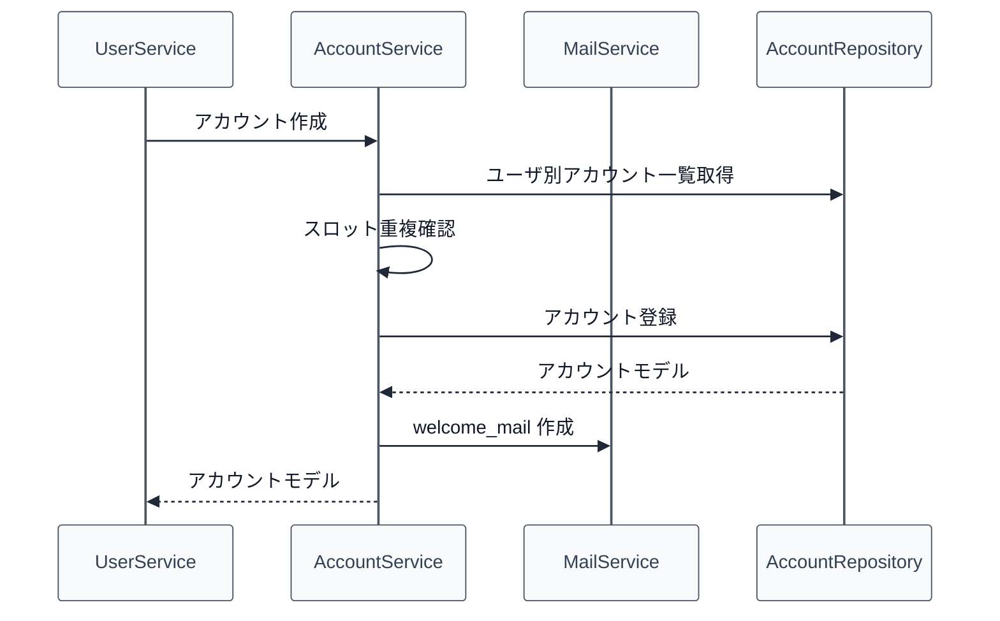

# 02_4.00-統合フロー

## 1. 初期アカウント作成（user -> account）

物理名対応:

- [[02_3.01-サービス]].アカウント作成
  - 物理名: `createAccount`
- [[02_3.03-リポジトリ]].ユーザ別アカウント一覧取得
  - 物理名: `findByUserId`
- [[02_3.03-リポジトリ]].アカウント登録
  - 物理名: `insert`

補足:

- 初回参加者向けの `welcome_mail` は [[18_3.00-メソッド仕様]].初回メール作成 へ委譲する。メール本文・既読状態・既読時報酬は mail feature を正本とする。

## 2. アカウントモード変更（command -> account -> player）

1. `/account mode` または `/am` を受け、コマンドで実行者権限・mode 値・対象アカウントを検証する
2. [[02_3.01-サービス]].アカウントモード更新を実行する
3. オンライン中の [[03_1.00-モデル定義]].プレイヤーセッション へアカウントモードを反映する
4. inventory feature へGUIインベントリ反映またはクリアを依頼する

## 3. ゲームモード連動（player event -> account -> player）

1. `PlayerGameModeChangeEvent` を受け、プレイヤーキャッシュから account mode と permission を取得する
2. permission `99` 以上のプレイヤーが ADVENTURE を選択した場合は `PLAYER`、CREATIVE を選択した場合は `ADMIN` へ更新する
3. アカウントモード更新後、既存のオンライン反映と inventory 反映を実行する
4. SURVIVAL / SPECTATOR は account mode を変更しない。`PLAYER` モードの変更要求は従来どおりキャンセルする

## 4. 経験値加算・レベルアップ（gameplay -> account -> skilltree -> status）

1. gameplay 報酬処理が対象アカウントと加算経験値を決定する
2. [[02_3.01-サービス]].経験値加算 を実行する
   - 即時 UI 用の `level` / `totalExperience` はメモリ上のキャッシュへ反映する
3. `totalExperience` を加算し、[[02_1.00-モデル定義]].プレイヤーレベル進行 の式でレベルアップ判定を行う
4. Mob 撃破契機の場合は、プレイヤーレベルアップ数からPP、クラスレベルアップ数からCPを算出し、skilltree の派生状態を再計算する。CP/PPそのものは account-skilltree API へ永続化しない
5. オンライン中かつレベルアップした対象なら、その場で `status` feature の再計算契機を発火し、レベル補正・スキルツリー効果を再反映する
6. `AccountService` の定期 flush タスクが [[02_3.03-リポジトリ]].アカウント進行更新 で `level` / `totalExperience` をまとめて保存する
7. プラグイン停止時は未 flush 分を同期 flush してから終了する
