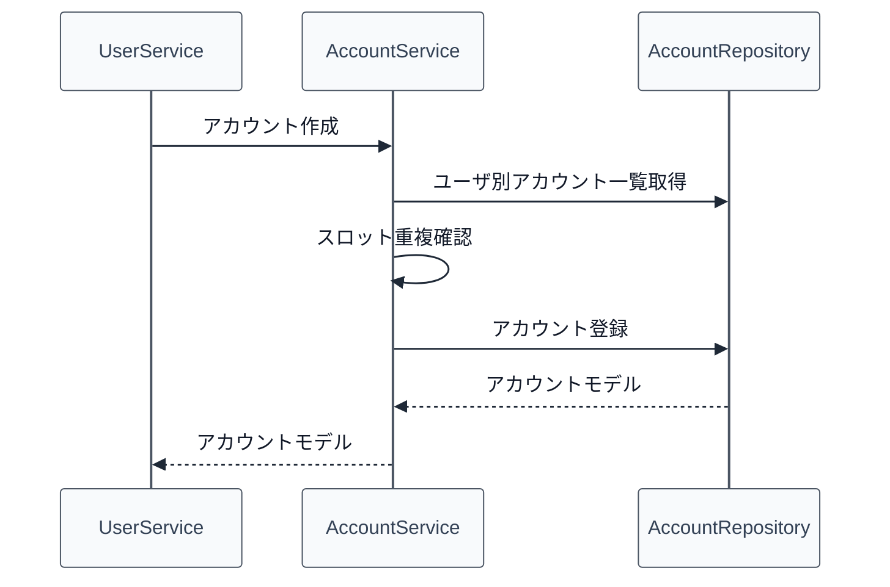

# 02_4.00-統合フロー

## 1. 初期アカウント作成（user -> account）

物理名対応:

- [[02_3.01-サービス]].アカウント作成
  - 物理名: `createAccount`
- [[02_3.03-リポジトリ]].ユーザ別アカウント一覧取得
  - 物理名: `findByUserId`
- [[02_3.03-リポジトリ]].アカウント登録
  - 物理名: `insert`

## 2. アカウントモード変更（command -> account -> player）

1. `/account mode` を受け、コマンドで実行者権限・mode 値・対象アカウントを検証する
2. [[02_3.01-サービス]].アカウントモード更新を実行する
3. オンライン中の [[03_1.00-モデル定義]].プレイヤーセッション へアカウントモードを反映する
4. inventory feature へGUIインベントリ反映またはクリアを依頼する

## 3. 経験値加算・レベルアップ（gameplay -> account -> status）

1. gameplay 報酬処理が対象アカウントと加算経験値を決定する
2. [[02_3.01-サービス]].経験値加算 を実行する
3. `totalExperience` を加算し、[[02_1.00-モデル定義]].プレイヤーレベル進行 の式でレベルアップ判定を行う
4. [[02_3.03-リポジトリ]].アカウント進行更新 で `level` / `totalExperience` を保存する
5. オンライン中の対象なら `status` feature の再計算契機を発火し、レベル補正を再反映する
