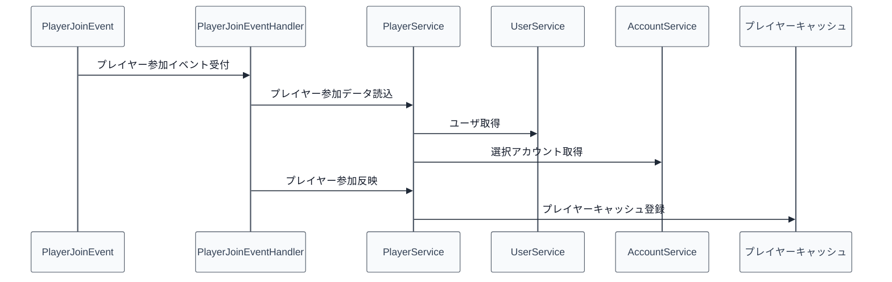

# 03_4.00-統合フロー

## 1. ログイン反映（event -> service -> user/account -> cache）

物理名対応:

- [[03_3.01-イベント]].プレイヤー参加イベント受付
  - 物理名: `onPlayerJoin`
- [[03_3.02-サービス]].プレイヤー参加データ読込
  - 物理名: `loadPlayerJoinData`
- [[03_3.02-サービス]].プレイヤー参加反映
  - 物理名: `applyPlayerJoin`
- [[03_3.04-キャッシュ]].プレイヤーキャッシュ登録
  - 物理名: `put`

## 2. ログアウト保存（event -> service -> save -> cache）

1. `PlayerQuitEvent` を受け、[[03_3.02-サービス]].プレイヤー退出処理を実行する
2. [[03_3.05-保存]].プレイヤー保存実行を実行する
3. [[03_3.04-キャッシュ]].プレイヤーキャッシュ削除を実行する
