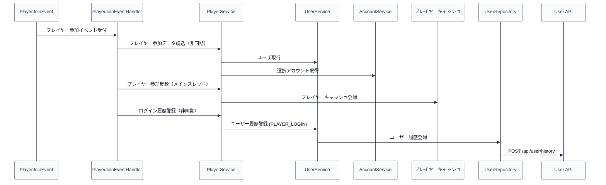

# 03_4.00-統合フロー

## 1. ログイン反映（event -> service -> user/account -> cache -> user history）

## 2. ログアウト保存（event -> service -> save -> cache -> user history）

1. `PlayerQuitEvent` を受け、[[03_3.02-サービス]].プレイヤー退出処理を実行する
2. [[03_3.05-保存]].プレイヤー保存実行を実行する
3. [[03_3.04-キャッシュ]].プレイヤーキャッシュ削除を実行する
4. 非同期で [[01_3.02-サービス]].ユーザー履歴登録 を実行し、user feature 側で `POST /api/user/history (PLAYER_LOGOUT)` を呼び出す
