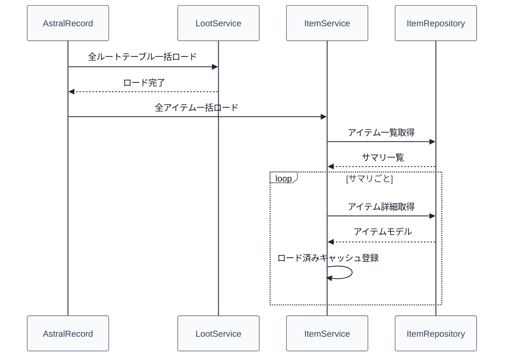
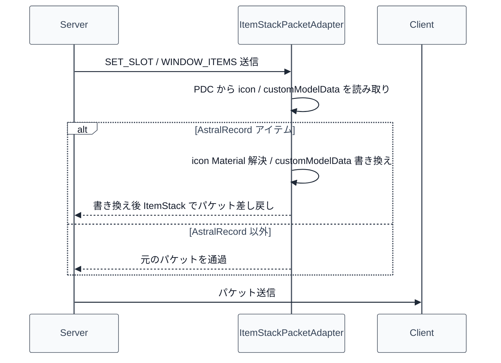

# 04_4.00-統合フロー

## 1. 起動時の一括ロード（service -> repository）

物理名対応:

- 全ルートテーブル一括ロード: [[06_3.02-サービス]].全ルートテーブル一括ロード（`LootService#loadAll`）
- 全アイテム一括ロード: `loadAll`（`ItemService`）
- アイテム一覧取得: `findAll`（`ItemRepository`）
- アイテム詳細取得: `findById`（`ItemRepository`）

## 2. `/item get` 付与処理（command -> service -> inventory -> menu）

1. 実行者が `/item get <itemId> [amount]` を実行する
2. コマンドが [[04_3.02-サービス]].個別アイテムロード（ID のみ）を呼ぶ
3. キャッシュ未保持の場合、サービスが詳細 API から取得して ID 単位キャッシュへ登録する
4. `InventoryService.addItemToNormalInventory` で実プレイヤーのインベントリへ付与を委譲する
5. 付与カテゴリを `resolveInventoryType` で解決する
6. `CURRENCY` ならカレンシーメニュー、それ以外なら通常インベントリ GUI を再描画する
7. 実行者へ付与結果を通知する

物理名対応:

- アイテム付与実行: `handleGet`（`ItemCommand`）
- 個別アイテムロード: `loadItem(itemId)`（`ItemService`）

## 3. パケット送信時の icon 書き換え（adapter）

物理名対応:

- パケットアダプタ登録: `register`（`ItemStackPacketAdapter`）
- SET_SLOT書き換え: `handleSetSlot`
- WINDOW_ITEMS書き換え: `handleWindowItems`
- アイコン書き換え判定: `replaceIcon`

## 4. 装備インスタンス生成（service -> repository -> API）

1. 呼び出し側が [[04_3.02-サービス]].装備インスタンス生成 を呼ぶ
2. リポジトリが `POST /api/equipment/instances` を発行する
3. API がステータスロールを解決し、確定済みインスタンスを返す
4. サービスが結果を呼び出し側へ返却する

物理名対応:

- 装備インスタンス生成: `createEquipmentInstance`（`ItemService` / `ItemRepository`）

## 5. ルーンインスタンス生成（service -> repository -> API）

1. 呼び出し側が [[04_3.02-サービス]].ルーンインスタンス生成 を呼ぶ
2. リポジトリが `POST /api/rune/instances` を発行する
3. API がステータスロールを確定し、インスタンスを返す
4. サービスが結果を呼び出し側へ返却する

物理名対応:

- ルーンインスタンス生成: `createRuneInstance`（`ItemService` / `ItemRepository`）
