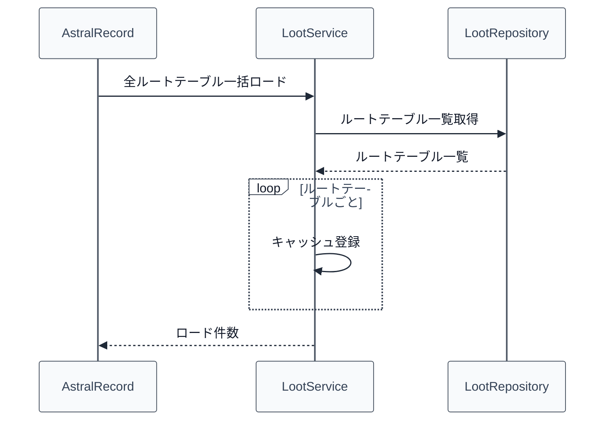

# 06_4.00-統合フロー

## 1. 起動時の一括ロード（service -> repository）

物理名対応:

- 全ルートテーブル一括ロード: `loadAll`（`LootService`）
- ルートテーブル一覧取得: `findAll`（`LootRepository`）

## 2. バンドル lore 表示時の参照（item -> loot）

1. `ItemStackFactory` の Lore 構築処理がバンドル拡張を持つ [[04_1.00-モデル定義]].アイテムモデル を検出する
2. [[04_3.02-サービス]].プロトタイプテンプレート構築 内のバンドルルートロア追加が [[06_3.02-サービス]].ロード済みルート取得 を呼ぶ
3. キャッシュにヒットした場合、各 [[06_1.00-モデル定義]].ルートエントリ を Lore 行へ整形する
4. キャッシュにヒットしない場合、`(未ロード)` を含む 1 行を Lore に追加する

物理名対応:

- ロード済みルート取得: `getLoaded`（`LootService`）
- バンドルルートロア追加: `appendBundleLootLore`（`ItemStackFactory`、プロトタイプテンプレート構築の内部処理）

## 3. キャッシュクリア・参照（管理経路）

1. 呼び出し側が [[06_3.02-サービス]].キャッシュクリア を呼ぶ
2. `loadedLoots` の中身が空になる
3. 以降の [[06_3.02-サービス]].ロード済みルート取得 / [[06_3.02-サービス]].ロード済みルート一覧取得 はそれぞれ `null` / 空リストを返す
4. 再ロードが必要な場合は [[06_3.02-サービス]].全ルートテーブル一括ロード を再度呼び出す

物理名対応:

- キャッシュクリア: `clearCache`（`LootService`）
- ロード済みルート一覧取得: `getLoadedLoots`（`LootService`）
