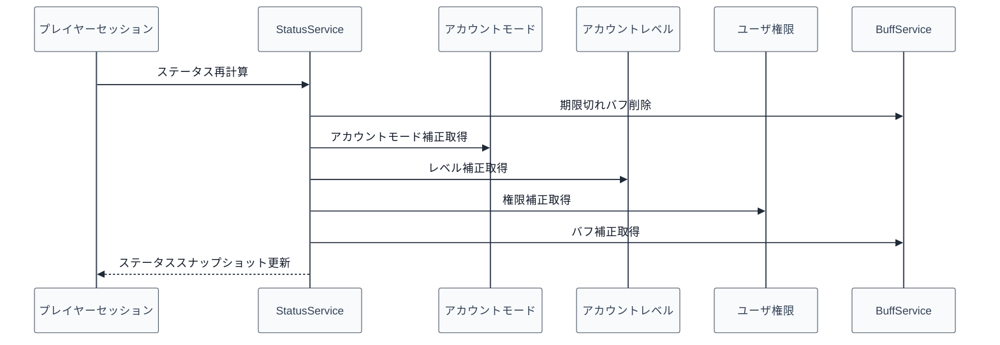

# 07_4.00-統合フロー

## 1. ステータス再計算（player/account/buff -> status）

物理名対応:

- [[07_3.02-サービス]].ステータス再計算
  - 物理名: `refreshStatus`
- [[05_3.02-サービス]].期限切れバフ削除
  - 物理名: `purgeExpired`
- [[07_3.02-サービス]].補正値取得
  - 物理名: `getBonusValue`
- [[07_3.02-サービス]].アカウントモード補正取得
  - 物理名: `getAccountModeBonus`
- [[07_3.02-サービス]].レベル補正取得
  - 物理名: `getLevelBonus`
- [[07_3.02-サービス]].権限補正取得
  - 物理名: `getPermissionBonus`
- [[05_3.02-サービス]].バフ補正合計取得
  - 物理名: `getTotalBonus`

## 2. ステータス表示（command -> service -> message）

1. `/status` を受け、[[07_3.03-コマンド]].ステータスコマンド実行 を実行する。
2. 表示種別に応じて [[07_3.03-コマンド]].ステータス表示 を通常表示または詳細表示で実行する。
3. [[07_3.02-サービス]].ステータス取得 で [[07_1.00-モデル定義]].ステータススナップショット を取得する。
4. `P_5100` から `P_5106` のプレイヤーメッセージを送信する。

## 3. 定期自然回復（task -> cache -> service）

1. プラグイン有効化時、[[07_3.05-タスク]].定期回復開始 を実行する。
2. `20tick` ごとに [[07_3.05-タスク]].定期回復処理 を実行する。
3. [[03_1.00-モデル定義]].プレイヤーキャッシュ から全セッションを取得する。
4. オンラインかつ生存しているプレイヤーのみ [[07_3.05-タスク]].単体回復処理 を実行する。
5. HP / MP / EN が最大値未満の場合、[[07_3.02-サービス]].HP回復, [[07_3.02-サービス]].MP回復, [[07_3.02-サービス]].EN回復 を実行する。

## 4. インベントリ変更時の装備反映（inventory -> status）

1. ホットバー切替・オフハンド切替・防具スロット操作・装備可能アイテムの装備操作を受けたら、装備スナップショットを更新する。
2. 装備更新が成功した場合、`refreshStatus` を実行してステータスを再計算する。
3. 成功時は `P_5601`（装備効果オン）をプレイヤーへ通知する。
4. 成功時の操作音は `GuiSound.EQUIP`、失敗時は `GuiSound.DENY` を再生する。
