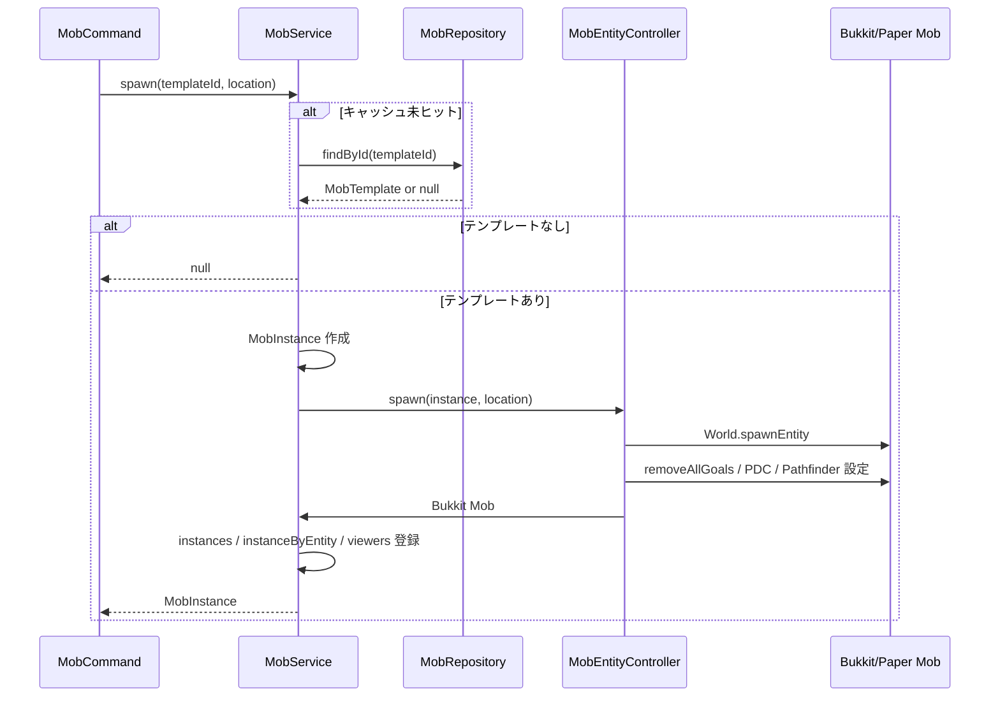
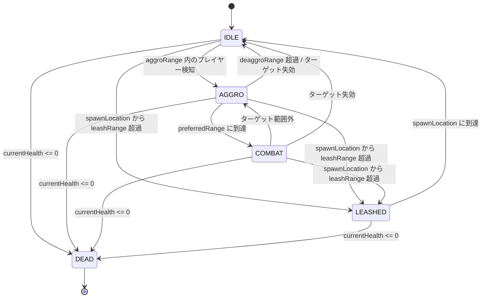
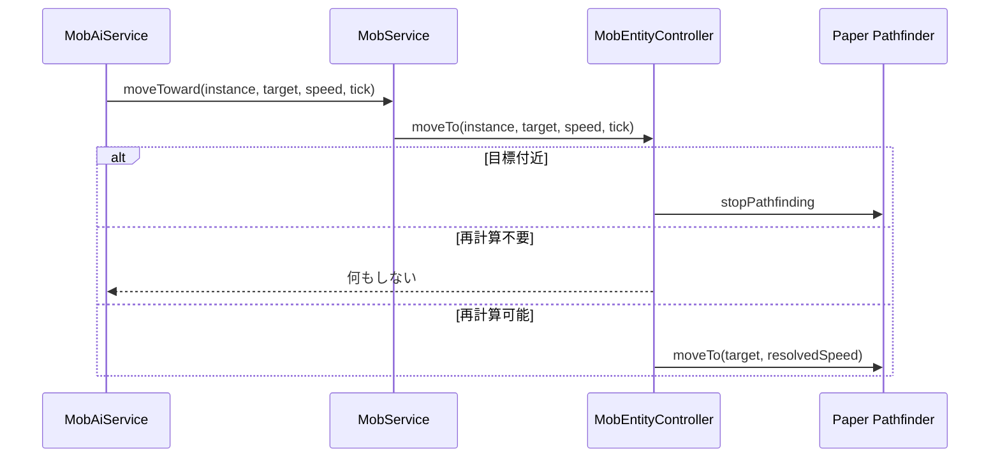
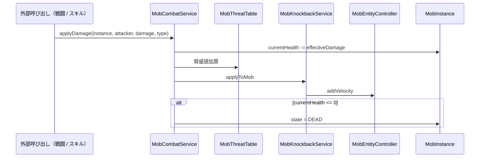
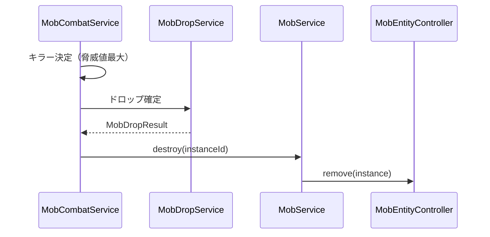

# 12_4.00-統合フロー

## 1. Mob スポーン（command -> service -> entity）

物理名対応:

- Mob スポーン: `spawn`（`MobService`）
- Mob 取得: `findById`（`MobRepository`）
- 実体 Mob 生成・初期化: `spawn` / `configure`（`MobEntityController`）

## 2. AI tick 駆動と状態遷移

`MobAiService.tick` は 1 tick 周期で動くが、100体想定のため以下を分散する。

- `IDLE`: 10 tick 間隔でターゲット探索・徘徊判断
- `AGGRO` / `LEASHED`: 5 tick 間隔で追跡判断
- `COMBAT`: `RANGED` / `MAGIC` は近すぎる場合に後退補助を入れ、`preferredRange` 付近では左右移動で距離を維持
- `MobService.updateViewers`: 5 tick 間隔で頭上表示用 viewer を更新
- Paper Pathfinder の再要求: 10 tick 間隔、または目標 X/Z が 1.5 ブロック以上動いた場合

## 3. 移動要求（AI -> Paper Pathfinder）

AI は「どこへ行くか」だけを決める。段差、障害物、実際の経路探索は Paper Pathfinder に委譲する。

## 4. 被ダメージシーケンス（player/skill -> mob）

Mob 実体は `setInvulnerable(true)` のため、バニラダメージイベントは HP の正本にはしない。

## 5. 致死処理（drop -> destroy）

`MobService.destroy` は実体 Mob を remove し、`instances` / `instanceByEntity` / `viewers` を更新する。

## 6. 頭上表示

1. `MobAiService.tick` が 5 tick ごとに `MobService.updateViewers` を呼ぶ。
2. `MobService` は実体位置を同期し、64 ブロック以内のプレイヤー UUID を viewer として保持する。
3. `OverheadDisplayService` は Mob の実体 Entity に HP テキストの TextDisplay を passenger として接続し、テキスト更新 / destroy を行う。
4. Mob 本体の表示・移動・破棄は Bukkit/Paper の entity tracking に任せる。
