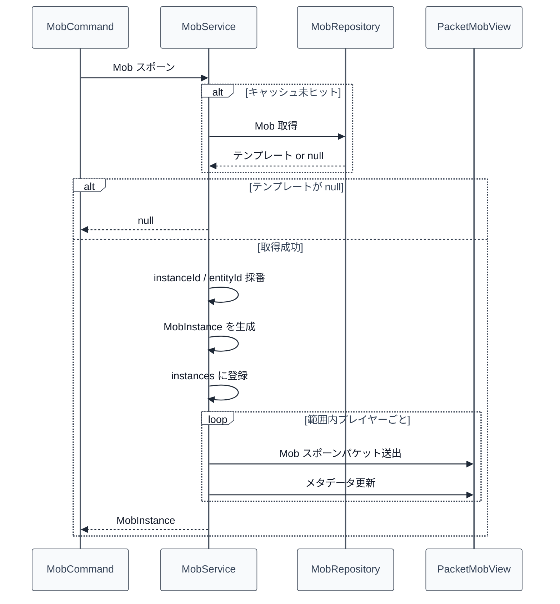
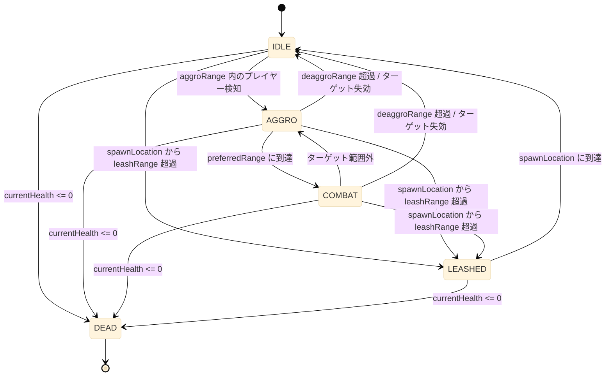
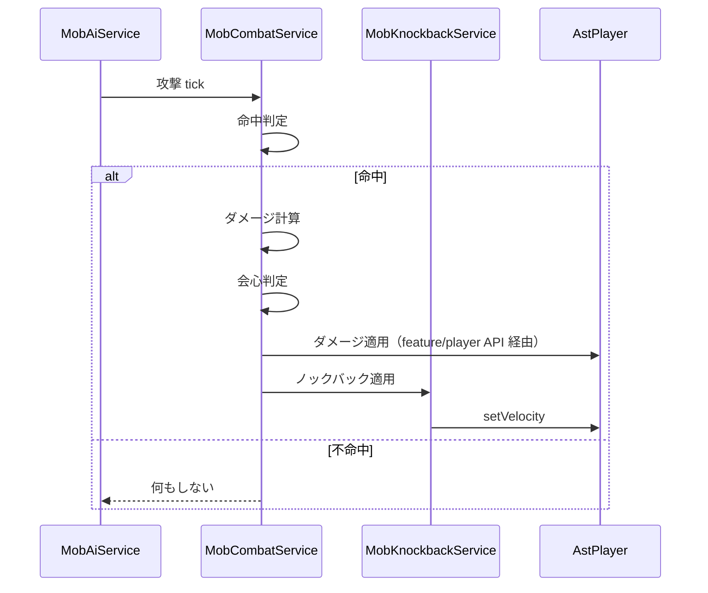
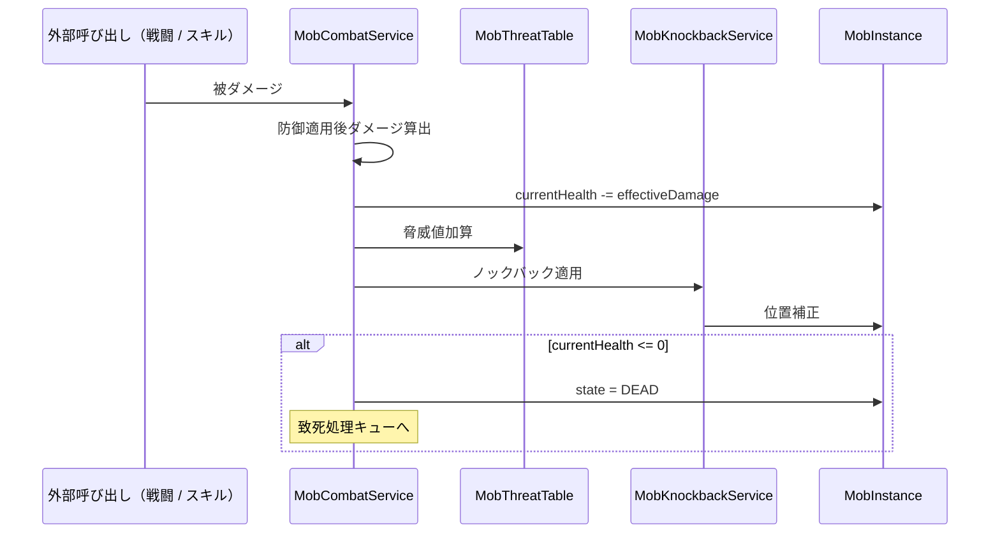
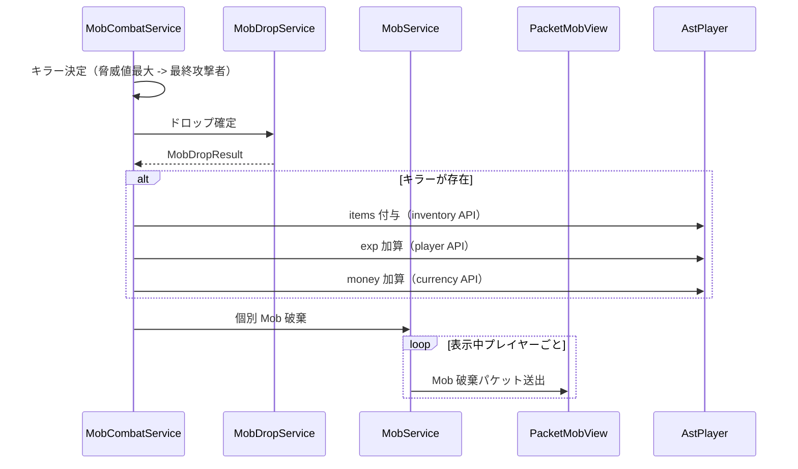

# 12_4.00-統合フロー

## 1. Mob スポーン（command -> service -> view）

物理名対応:

- Mob スポーン: `spawn`（`MobService`）
- Mob 取得: `findById`（`MobRepository`）
- Mob スポーンパケット送出: `spawn`（`PacketMobView`）
- メタデータ更新: `updateMetadata`（`PacketMobView`）

## 2. AI tick 駆動と状態遷移

各遷移は `MobAiService.tick` 内で 1 tick 単位に判定する。

物理名対応:

- tick 本体: `tick`（`MobAiService`）
- ターゲット選定: `selectTarget`（`MobCombatService`）
- 攻撃 tick: `tickCombat`（`MobCombatService`）

## 3. Mob 攻撃シーケンス（combat -> player）

物理名対応:

- 攻撃 tick: `tickCombat`（`MobCombatService`）
- ダメージ計算: `computeDamage`（`MobCombatService`）
- 会心判定: `applyCriticalMultiplier`（`MobCombatService`）
- ノックバック適用: `apply`（`MobKnockbackService`）

## 4. 被ダメージシーケンス（player -> mob）

物理名対応:

- 被ダメージ: `applyDamage`（`MobCombatService`）
- 脅威値加算: `add`（`MobThreatTable`）
- ノックバック適用: `apply`（`MobKnockbackService`）

## 5. 致死処理（drop -> distribute -> destroy）

物理名対応:

- 致死処理: `handleDeath`（`MobCombatService`）
- ドロップ確定: `roll`（`MobDropService`）
- 個別 Mob 破棄: `destroy`（`MobService`）
- Mob 破棄パケット送出: `destroy`（`PacketMobView`）

## 6. 表示範囲更新

1. `MobAiService.tick` が `MobService.updateViewers` を呼ぶ
2. インスタンスごとに「現在表示中のプレイヤー UUID 集合」と「現在範囲内のプレイヤー UUID 集合」の差分を算出
3. 新規プレイヤー集合へ `PacketMobView.spawn` を呼ぶ
4. 範囲外プレイヤー集合へ `PacketMobView.destroy` を呼ぶ
5. 範囲内継続プレイヤーへは `PacketMobView.move` を呼ぶ

物理名対応:

- 表示範囲更新: `updateViewers`（`MobService`）
- Mob スポーンパケット送出 / Mob 破棄パケット送出 / 位置・回転更新: `spawn` / `destroy` / `move`（`PacketMobView`）
