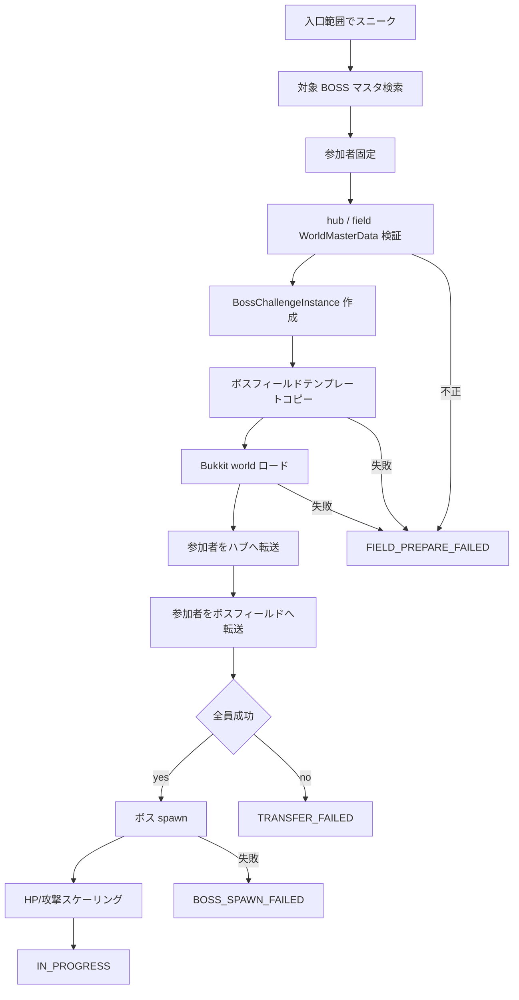
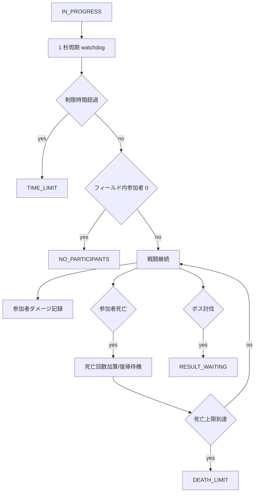

# ボス機能 理想統合フロー

## 受付から戦闘開始

## 戦闘中

## 討伐成功

1. `DamageService` がボス死亡を検出する。
2. ボス挑戦側で `DEFEATED` を確定する。
3. 報酬対象者を `participantIds` と討伐時 world で固定する。
4. 報酬を確定付与する。
5. ダメージランキング TextDisplay を表示する。
6. 15 秒後に参加者をハブへ戻す。
7. ボスフィールドを unload / delete する。
8. `partyKey` と `challengeId` のキャッシュを削除する。

## 失敗終了

1. 終了理由を確定する。
2. ボスが残っていれば destroy する。
3. 報酬は付与しない。
4. 参加者をハブへ戻す。
5. フィールドを unload / delete する。
6. `partyKey` と `challengeId` のキャッシュを削除する。

## 起動時掃除

1. 起動時に `WorldMasterData` をロードする。
2. `worldType=BOSS_FIELD` かつ `instanceEnabled=true` の `instanceRootPath` を列挙する。
3. 現在アクティブな `BossChallengeInstance` に紐づかないフォルダを残存インスタンスとみなす。
4. Bukkit world としてロードされていれば unload する。
5. フォルダ削除に成功した件数と失敗した件数をログへ出す。
