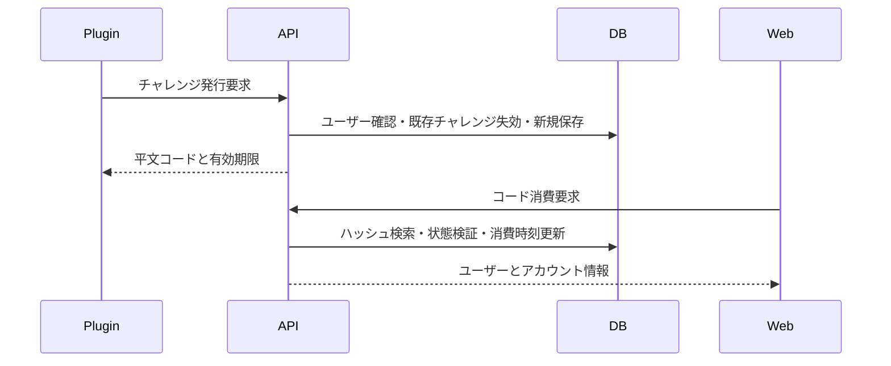

# 24_4.00-統合フロー

```mermaid
sequenceDiagram
    participant Plugin
    participant API
    participant DB
    participant Web
    Plugin->>API: チャレンジ発行要求
    API->>DB: ユーザー確認・既存チャレンジ失効・新規保存
    API-->>Plugin: 平文コードと有効期限
    Web->>API: コード消費要求
    API->>DB: ハッシュ検索・状態検証・消費時刻更新
    API-->>Web: ユーザーとアカウント情報
```
