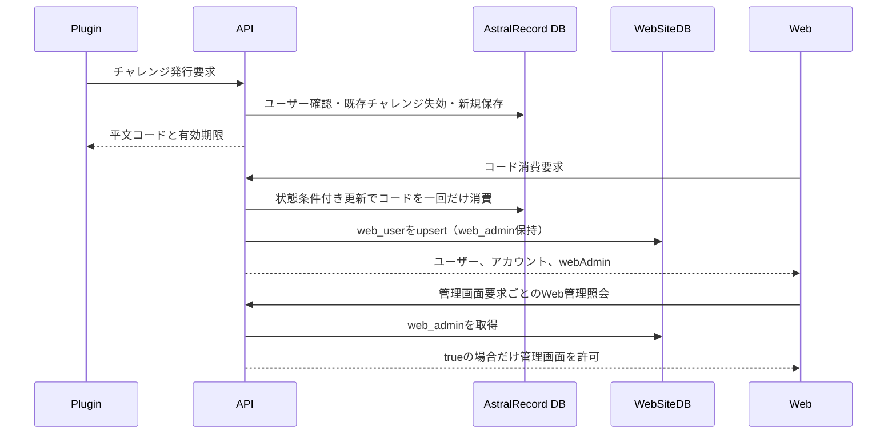

# 24_4.00-統合フロー

```mermaid
sequenceDiagram
    participant Plugin
    participant API
    participant GameDB as AstralRecord DB
    participant WebSiteDB
    participant Web
    Plugin->>API: チャレンジ発行要求
    API->>GameDB: ユーザー確認・既存チャレンジ失効・新規保存
    API-->>Plugin: 平文コードと有効期限
    Web->>API: コード消費要求
    API->>GameDB: 状態条件付き更新でコードを一回だけ消費
    API->>WebSiteDB: web_userをupsert（web_admin保持）
    API-->>Web: ユーザー、アカウント、webAdmin
    Web->>API: 管理画面要求ごとのWeb管理照会
    API->>WebSiteDB: web_adminを取得
    API-->>Web: trueの場合だけ管理画面を許可
```
