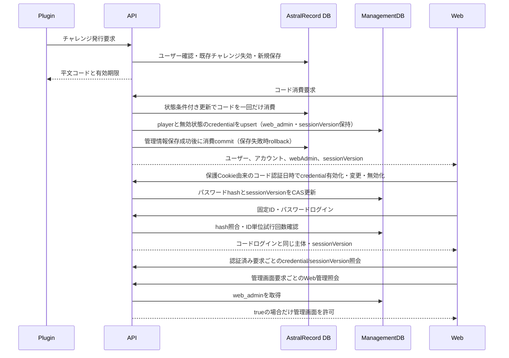

# 24_4.00-統合フロー

```mermaid
sequenceDiagram
    participant Plugin
    participant API
    participant GameDB as AstralRecord DB
    participant ManagementDB
    participant Web
    Plugin->>API: チャレンジ発行要求
    API->>GameDB: ユーザー確認・既存チャレンジ失効・新規保存
    API-->>Plugin: 平文コードと有効期限
    Web->>API: コード消費要求
    API->>GameDB: 状態条件付き更新でコードを一回だけ消費
    API->>ManagementDB: playerと無効状態のcredentialをupsert（web_admin・sessionVersion保持）
    API->>GameDB: 管理情報保存成功後に消費commit（保存失敗時rollback）
    API-->>Web: ユーザー、アカウント、webAdmin、sessionVersion
    Web->>API: 保護Cookie由来のコード認証日時でcredential有効化・変更・無効化
    API->>ManagementDB: パスワードhashとsessionVersionをCAS更新
    Web->>API: 固定ID・パスワードログイン
    API->>ManagementDB: hash照合・ID単位試行回数確認
    API-->>Web: コードログインと同じ主体・sessionVersion
    Web->>API: 認証済み要求ごとのcredential/sessionVersion照会
    Web->>API: 管理画面要求ごとのWeb管理照会
    API->>ManagementDB: web_adminを取得
    API-->>Web: trueの場合だけ管理画面を許可
```
