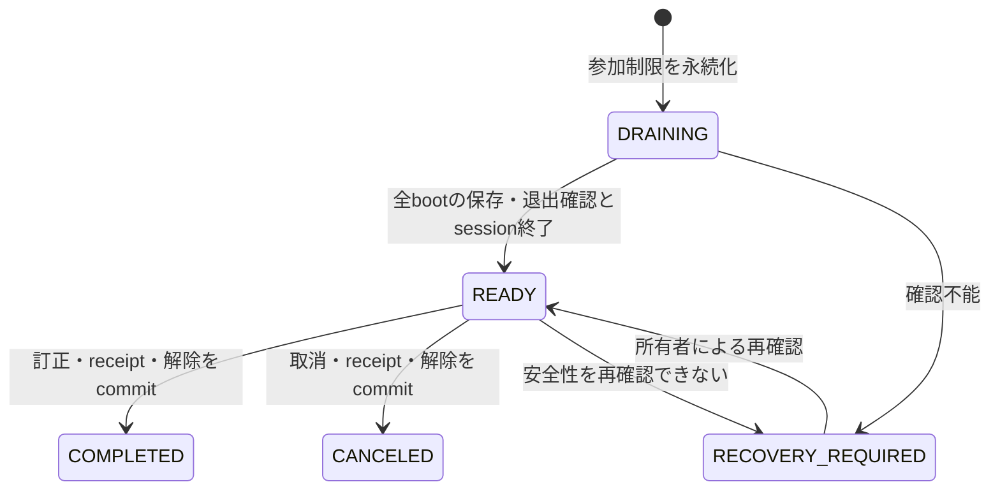

# 40_player-admin-edit 概要

Web管理者が対象アカウントのinventory・現在クラス・プレイヤーレベルを訂正する。編集開始から反映または取消の確定まで、ユーザーUUID単位で全アカウントへの参加を制限する。

## 正本と操作単位

オンライン中の正本はPluginの完成状態と保存snapshotである。APIは退避中の既存sessionによる最終保存を許可し、全サーバーの保存・退出確認とaccount sessionの明示終了後だけオフライン訂正を許可する。Webは表示と操作要求を担当し、DBへ直接書き込まない。

編集セッションは対象アカウント・対象ユーザー・操作者を固定する。反映はレベル・現在クラス・複数inventory変更を一つのゲームDBトランザクションにまとめ、操作receiptと参加制限解除も同時に確定する。取消は未反映の変更を捨て、保存・退出確認後に参加制限を解除する。

## 状態と競合

`APPLYING`は反映処理の内部段階であり、参加制限対象に含める。期限切れ・API再起動・heartbeat欠落・ブラウザ閉鎖だけでは制限を解除しない。応答必須サーバーが未登録、起動IDが変わった、保存結果が不明の場合は編集可能にしない。

編集開始、account session取得、snapshot、反映はユーザーからアカウントの順にロックする。最終保存は未退避の`DRAINING / RECOVERY_REQUIRED`でcaptureされた既存権限だけに許可し、`READY`以降の旧session保存を拒否する。元の正確な権限による最終snapshotと初回session-closeは通常lease期限後も完了できるが、新規session取得・通常保存の期限条件は緩和しない。確定済みsnapshot再送と閉鎖済みの同一identity照会は読み取り専用とする。

## MVPの訂正規則

| 対象 | 規則 |
|---|---|
| プレイヤーレベル | 1～100。アカウントUUID依存の既存EXP閾値と同時更新。最高到達レベルを保持。転生中は拒否 |
| 現在クラス | 公開定義から選択。クラス別進行を保持し、未経験クラスはLv.1・EXP 0 |
| 通常アイテム | 安全な通常inventoryへの付与、数量変更、削除。stack上限・容量を厳守 |
| 装備付与 | 個体UUID・抽選値・ルーン枠・inventory entryを同時生成。装備は個体ごとに別entry |
| 参照中entry | 装備・loadout・hotbar・market等から参照される削除は拒否 |

通貨の直接訂正、装備の抽選値改変、装着ルーン・loadout・習得スキルの直接編集は含めない。習得個体、bind、スキルツリー解放記録は保持し、派生値と利用可否は次回参加の通常ロードで再計算する。

必要なマスタが欠落、またはAPIと参加先Pluginの定義が一致しない訂正は拒否する。外部書込みとの競合は期待revision、確認した状態hash、マスタ版とentry版を反映トランザクション内で再検証する。

## 関連資料

- [[40_1.00-モデル定義]]
- [[40_3.00-エンドポイント仕様]]
- [[40_5.00-例外・ログ・運用]]
- [[40_0-概要]]
