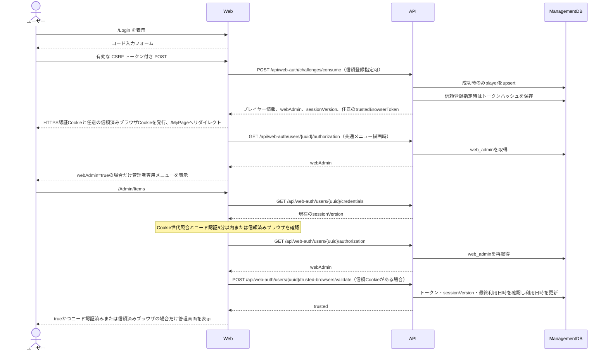

# 01_4.00-統合フロー

コード消費またはWeb管理権限照会のAPI障害時は、Cookie発行または管理画面表示を行いません。

ID・パスワード方式は `POST /api/web-auth/password/login` から同じCookie発行処理へ合流する。`GET credentials` がCookie世代と一致しない場合・API障害時はサインアウトする。設定更新はCookieの本人UUID・世代・直近コード日時と入力パスワードをWebサーバーからAPIへ渡し、APIの原子的更新で得た新世代だけを操作端末へ再発行する。再認証のコード消費には本人UUIDを指定し、他人のコードを受け付けない。
