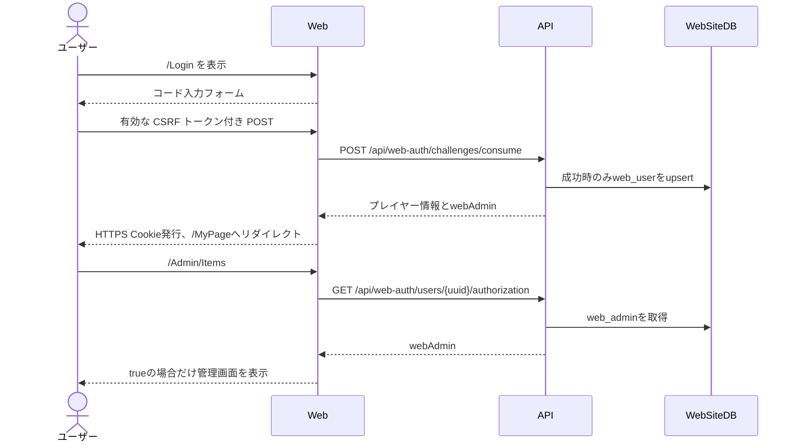

# 01_4.00-統合フロー

```mermaid
sequenceDiagram
    actor User as ユーザー
    participant Web
    participant API
    participant WebSiteDB
    User->>Web: /Login を表示
    Web-->>User: コード入力フォーム
    User->>Web: 有効な CSRF トークン付き POST
    Web->>API: POST /api/web-auth/challenges/consume
    API->>WebSiteDB: 成功時のみweb_userをupsert
    API-->>Web: プレイヤー情報とwebAdmin
    Web-->>User: HTTPS Cookie発行、/MyPageへリダイレクト
    User->>Web: /Admin/Items
    Web->>API: GET /api/web-auth/users/{uuid}/authorization
    API->>WebSiteDB: web_adminを取得
    API-->>Web: webAdmin
    Web-->>User: trueの場合だけ管理画面を表示
```

コード消費またはWeb管理権限照会のAPI障害時は、Cookie発行または管理画面表示を行いません。
