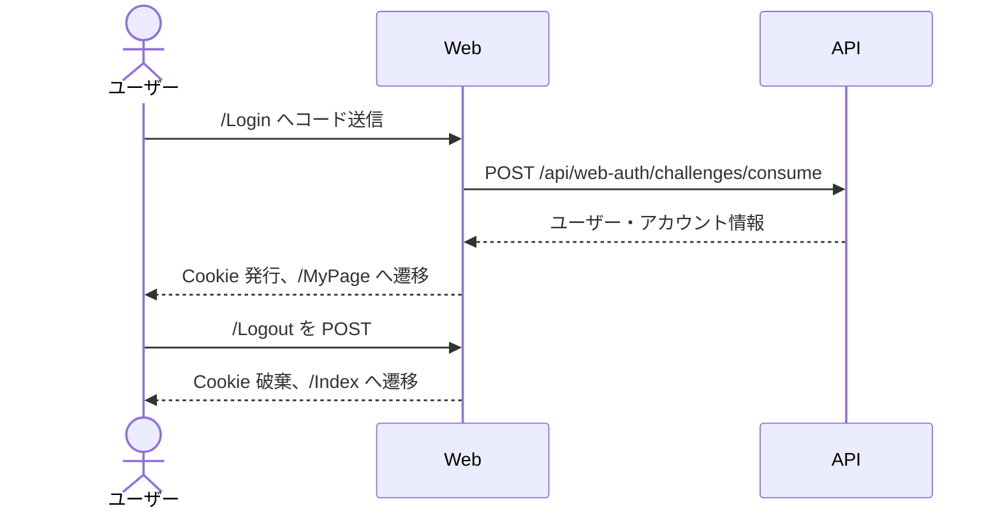

# 01_4.00-統合フロー

```mermaid
sequenceDiagram
    actor User as ユーザー
    participant Web
    participant API
    User->>Web: /Login へコード送信
    Web->>API: POST /api/web-auth/challenges/consume
    API-->>Web: ユーザー・アカウント情報
    Web-->>User: Cookie 発行、/MyPage へ遷移
    User->>Web: /Logout を POST
    Web-->>User: Cookie 破棄、/Index へ遷移
```
