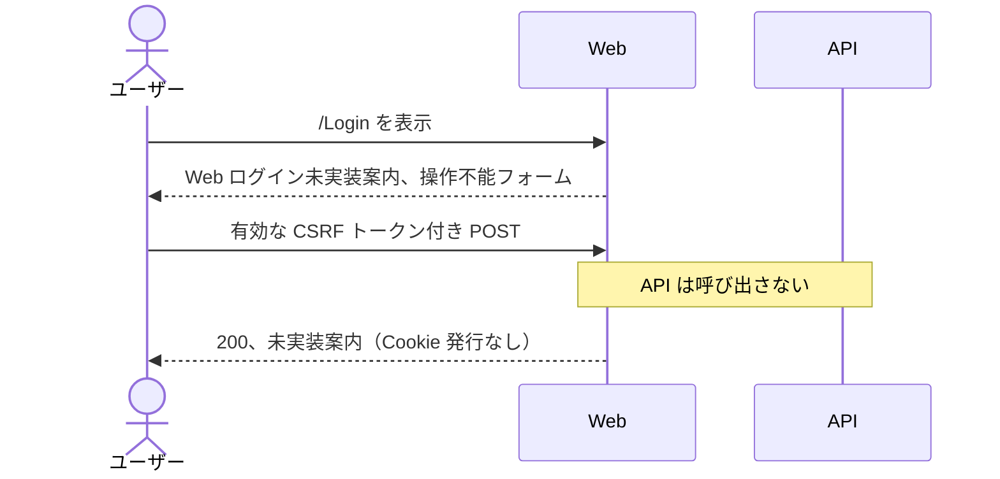

# 01_4.00-統合フロー

```mermaid
sequenceDiagram
    actor User as ユーザー
    participant Web
    participant API
    User->>Web: /Login を表示
    Web-->>User: Web ログイン未実装案内、操作不能フォーム
    User->>Web: 有効な CSRF トークン付き POST
    Note over Web,API: API は呼び出さない
    Web-->>User: 200、未実装案内（Cookie 発行なし）
```

再開時は API 消費、Cookie 発行、`/MyPage` 遷移を含む統合フローへ、実装・テストと同時に更新します。
