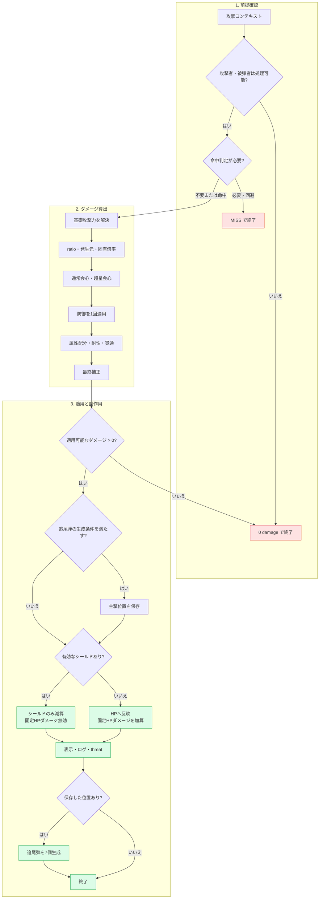
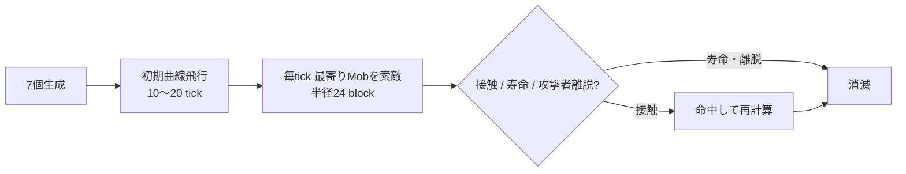
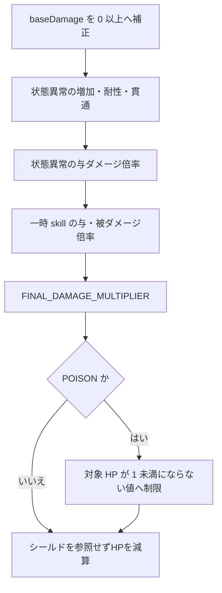

# 戦闘計算

> [!abstract] この資料で確認すること
> 現行実装のダメージ・経験値計算を、バランス調整で再利用できる形にまとめる。目標値と TTK・耐久時間の基準は [[02-成長曲線]] を参照する。

> [!info] この資料の索引
> - [[#3. 計算経路の全体像|通常攻撃・skill・DoT の経路]]
> - [[#4. 統合ダメージの計算式|ダメージ式と補正順序]]
> - [[#5. 計算例|具体的な試算]]
> - [[#6. 超星会心の追尾弾|追尾弾の仕様]]
> - [[#8. 状態異常 DoT|DoT の例外経路]]
> - [[#11. 撃破経験値のレベル差補正|経験値補正]]

## 1. この文書の位置づけ

本書は、2026-07-31 時点で Plugin に実装されている戦闘・経験値計算を、バランス調整で参照しやすい形に整理したものである。

- 記載する数値・式・適用順は、現行実装の把握用である。
- シールド仕様など、未決事項に記載した内容を「目標バランスとして採用済み」と定める文書ではない。
- 実装仕様と補正順序の正本は `00_docs/10_Plugin設計書/feature/14-combat/` と Plugin ソースである。
- 本書と実装が食い違う場合は実装を優先し、本書を更新する。

今後のバランス調整では、本書の式を前提に、成長曲線・職業差・敵の耐久・skill 係数を決める。

> [!warning] 正本の優先順位
> この資料は現行実装の把握用である。実装仕様・補正順序と矛盾した場合は、`00_docs/10_Plugin設計書/feature/14-combat/` と Plugin 実装を優先し、本書を更新する。

## 2. 先に押さえる要点

### 2.1 AstralRecord の一撃は Plugin が計算する

管理対象のプレイヤーまたは Mob が関わる戦闘では、Bukkit のダメージイベントを入口として使う場合でも、管理対象の HP を Bukkit のダメージ値で直接減らさない。イベントをキャンセルし、`DamageService` が独自に計算した値をプレイヤーの独自 HP または `MobInstance.currentHealth` へ反映する。

通常のプレイヤー攻撃は `baseDamage = 0` から始まり、武器の Bukkit ダメージではなく、攻撃者の status から攻撃力を組み立てる。

### 2.2 通常攻撃と skill は同じ計算経路を使う

- 通常攻撃は、無属性 `NONE: 1.0`（100%）を既定値とする。
- skill は `FIRE: 1.5`（火属性150%）のような属性成分を渡す。
- 属性成分の `ratio` は「全体威力」と「属性への配分」を兼ねる。

### 2.3 `FIXED` scaling とHP固定ダメージは別物

`FIXED` は外部から渡された `baseDamage` を攻撃力として使い、命中判定を省略する方式である。管理対象の攻撃者がいる場合の会心、被弾者の防御、属性補正、最終補正、シールドは通常どおり適用する。

攻撃者ステータス`FIXED_HEALTH_DAMAGE`は、直接攻撃の命中ごとに通常HPダメージへ加算する別成分である。防御、会心、属性、最終ダメージ倍率、ライフスティール算出元の影響を受けない。有効シールド中、回避・無効時、状態異常DoTでは発生しない。

### 2.4 一撃の結果はシールドか HP のどちらか一方

有効なシールドがある場合、その一撃はシールドだけを減らす。シールドを破壊しても、余剰ダメージは同じ一撃で HP へ通さない。

## 3. 計算経路の全体像

現在のダメージ処理は、通常の一撃を処理する「統合ダメージ経路」と、状態異常 DoT の「専用経路」に分かれる。

> [!success] 通常の統合経路
> | 経路 | 主な呼び出し元 | 命中 | 会心 | 防御 | 属性 | シールド |
> |:--|:--|:--:|:--:|:--:|:--:|:--:|
> | 統合ダメージ | `DamageService.attack` / `applyDamage` | 条件付き | あり | あり | あり | あり |
> | Mob 自律攻撃 | `MobCombatService` → `DamageService.attack` | あり | あり | あり | あり | あり |

> [!warning] 例外・再計算経路
> | 経路 | 主な呼び出し元 | 統合経路との差 |
> |:--|:--|:--|
> | 超星会心追尾弾 | `SuperStarCriticalProjectileService` → `DamageService.applyDamage` | 命中・通常会心・防御・属性を命中時点で再計算。シールドあり。 |
> | 状態異常 DoT | `DamageService.applyConditionDamage` | 命中・会心・防御・通常属性を使わず、シールドを貫通して残量を変えない。 |

### 3.1 統合ダメージの処理フロー



> [!NOTE]
> 超星会心の追尾弾生成可否は、シールドへ変換する前の最終ダメージで判定する。このため、主撃がシールドに吸収されても追尾弾は生成される。

## 4. 統合ダメージの計算式

### 4.1 記号

| 記号 | 意味 |
|:--|:--|
| `B` | 外部から渡された `baseDamage` |
| `P` | 攻撃種別に対応する基本能力値 |
| `T` | 攻撃種別に対応する種別攻撃力 |
| `A` | status から計算した攻撃力 |
| `R` | scaling と `baseDamage` を解決した基礎攻撃力。ログの `AP` |
| `Σratio` | 0 より大きい属性成分 `ratio` の合計 |
| `D` | 貫通適用後の全体防御と種別防御の合計 |

攻撃種別ごとの参照 status は次のとおりである。

| 攻撃種別 | 基本能力値 `P` | 種別攻撃力 `T` | 種別防御 |
|:--|:--|:--|:--|
| `MELEE` | `STRENGTH` | `MELEE_ATTACK` | `MELEE_DEFENSE` |
| `RANGED` | `DEXTERITY` | `RANGED_ATTACK` | `RANGED_DEFENSE` |
| `MAGIC` | `INTELLIGENCE` | `MAGIC_ATTACK` | `MAGIC_DEFENSE` |

どの攻撃種別でも、種別防御に加えて共通の `DEFENSE` を使用する。

### 4.2 手順1: 命中判定

> [!tip] 入力 → 判定 → 次段
> `ACCURACY` と `EVASION` から命中率を求める。回避ならここで `MISS` として終了し、以降の補正は一切適用しない。

命中判定は、次の両方を満たす場合だけ行う。

1. `scaling = ATTACKER_STATUS`
2. 攻撃者が AstralRecord の管理対象である

```text
攻撃者命中 A_hit = max(0, ACCURACY)
被弾者回避 E     = 管理対象なら max(0, EVASION)、管理外なら 0
命中率 H         = clamp(A_hit - E, 1, 100)
命中             = H = 100 の場合は必中、それ以外は random[0, 100) < H
```

回避によって命中率は1%未満にならないため、回避だけで完全回避はできない。攻撃者の命中率が回避を100以上上回る場合は命中率100%となり、乱数判定を行わず確実に命中する。

例外・既定値は次のとおりである。

| 条件 | 扱い |
|:--|:--|
| Mob の `ACCURACY <= 0` | `A_hit = 100` |
| プレイヤーの `ACCURACY <= 0` | `A_hit = 0` |
| `FIXED` | 命中判定を省略し、命中率100% |
| 攻撃者が管理外または存在しない | 命中判定を省略し、命中率100% |

回避された場合は、以降のダメージ計算を行わず `MISS` で終了する。

### 4.3 手順2: 基礎攻撃力を解決

`ATTACKER_STATUS` かつ攻撃者が管理対象の場合、status 攻撃力 `A` を次式で求める。

```text
A = ATTACK × (1 + P / 100) + T
```

scaling ごとの基礎攻撃力 `R` は次のとおりである。

```text
ATTACKER_STATUS かつ管理対象の攻撃者あり:
R = max(0, max(B, A))

FIXED、または管理対象の攻撃者なし:
R = max(0, B)
```

通常の status 攻撃は `B = 0` で呼ばれるため、実質的に `R = max(0, A)` となる。

### 4.4 手順3: 威力・発生元・攻撃者固有倍率

0 以下の属性 `ratio` を除外し、残った `ratio` の合計を求める。合計が 0 以下ならダメージは 0 となる。

```text
会心前ダメージ = R
               × Σratio
               × 発生元ダメージ倍率
               × 攻撃者固有ダメージ倍率
```

発生元ダメージ倍率は次のとおりである。

| `DamageSource` | 管理対象の攻撃者に使う倍率 |
|:--|:--|
| `NORMAL_ATTACK` | `max(0, 1 + NORMAL_ATTACK_DAMAGE_INCREASE / 100)` |
| `SKILL` | `max(0, 1 + SKILL_DAMAGE_INCREASE / 100)` |
| `OTHER` | `1.0` |

`FIXED` でも、発生元が `SKILL` なら `SKILL_DAMAGE_INCREASE` を適用する。攻撃者が管理外または存在しない場合、発生元ダメージ倍率は `1.0` となる。

攻撃者固有ダメージ倍率は通常 `1.0` である。Mob 自律攻撃では `MobInstance.outgoingDamageMultiplier` をここで掛ける。この倍率は会心・防御より前に適用する。

### 4.5 手順4: 通常会心・超星会心

会心前ダメージが正で、攻撃者が管理対象の場合に通常会心を判定する。超星会心は、攻撃者がプレイヤーかつ被弾者が Mob の場合に、通常会心とは独立して判定する。

```text
通常会心成立時: ダメージ ×= CRITICAL_DAMAGE / 100
主撃の超星会心成立時（ROLL）:
    ダメージ ×= 1 + SUPER_CRITICAL_DAMAGE / 100
追尾弾の超星会心強制適用時（FORCE）:
    ダメージ ×= SUPER_CRITICAL_DAMAGE / 100
```

| 項目 | 実装上の扱い |
|:--|:--|
| `CRITICAL_RATE` / `SUPER_CRITICAL_RATE` | 0 未満を 0 にする。上限100には丸めないため、100以上は必ず成立 |
| `CRITICAL_DAMAGE <= 0` | 150% を使用 |
| `SUPER_CRITICAL_DAMAGE <= 0` | 30% を使用 |
| 両方成立 | 通常会心倍率と超星会心倍率を両方掛ける |

`SUPER_CRITICAL_DAMAGE = 30` の場合、発生率を判定して成立した主撃は `× 1.30`、主撃から生成された追尾弾は `× 0.30` となる。追尾弾の `FORCE` は超星会心を再抽選せず、元の主撃とは異なり100%を加算しない。通常会心と超星会心が両方成立した場合は、通常会心倍率とこのモード別の超星会心倍率を乗算する。

プレイヤーの status 基礎値は、通常会心率5%、通常会心倍率150%、超星会心率0%、超星会心倍率30%である。ただし実際の判定には装備・class・buff・基本能力値からの派生を反映した最終 status を使う。たとえば基礎 `LUCK = 5` は通常会心率へ0.5ポイント加算されるため、ほかの補正がなくても派生後の通常会心率は5.5%となる。

### 4.6 手順5: 防御

> [!important] 防御で先に見る結論
> ==`R = D` なら 50% 軽減==、==`D / R >= 2.5` ならダメージ 0==。防御は属性分割前の合計ダメージへ **1回だけ** 適用する。

被弾者が管理対象の場合だけ、会心後の合計ダメージへ防御倍率を1回適用する。共通防御と種別防御には、それぞれ別の貫通率を使う。

防御倍率は、手順2で解決した攻撃力 `R` と、貫通適用後の有効防御力 `D` の比率で決める。`R` は属性成分の `ratio`、発生元倍率、攻撃者固有倍率、会心を掛ける前の値である。

```text
有効共通防御 = max(0, DEFENSE)
             × max(0, 1 - max(0, DEFENSE_PENETRATION_RATE) / 100)

有効種別防御 = max(0, 種別防御)
             × max(0, 1 - max(0, 種別防御貫通率) / 100)

B = 2.5
G = log(0.5) / log(1 - 1 / B)
  ≒ 1.35691545

R <= 0 の場合:
    Q は計算しない
    防御倍率 = 0

R > 0 の場合:
    D = 有効共通防御 + 有効種別防御
    Q = D / R

R > 0 かつ Q >= B の場合:
    防御倍率 = 0

R > 0 かつ Q < B の場合:
    防御倍率 = (1 - Q / B) ^ G

防御後ダメージ = 会心後ダメージ × 防御倍率
```

種別防御貫通率は、攻撃種別に応じて `MELEE_DEFENSE_PENETRATION_RATE`、`RANGED_DEFENSE_PENETRATION_RATE`、`MAGIC_DEFENSE_PENETRATION_RATE` を使う。

`B` は完全防御になる攻防比率である。現行値 `2.5` では、有効防御力が解決攻撃力の2.5倍以上になるとダメージは0になる。`G` は「攻撃力と防御力が同値なら50%軽減」を維持するため、`B` から算出する。

| `R` | `D` | 攻防比 `Q` | 防御後に残る割合 | 軽減率 |
|--:|--:|--:|--:|--:|
| 100 | 0 | 0.0 | 100.00% | 0.00% |
| 100 | 50 | 0.5 | 73.88% | 26.12% |
| 100 | 100 | 1.0 | 50.00% | 50.00% |
| 100 | 150 | 1.5 | 28.84% | 71.16% |
| 100 | 200 | 2.0 | 11.26% | 88.74% |
| 100 | 250 | 2.5 | 0.00% | 100.00% |
| 100 | 900 | 9.0 | 0.00% | 100.00% |

同じ `R` と `D` なら、通常攻撃・高倍率 skill・会心・超星会心の軽減率は同じになる。たとえば `R = 100`、`D = 100` では、通常攻撃100は50、300% skill は150、300% skill が200%会心になった600は300となる。高倍率攻撃ほど防御の固定値が相対的に無意味になる問題を避けつつ、防御を盛ったときは完全防御まで到達できる。

### 4.7 手順6: 属性配分・耐性

> [!tip] 入力 → 配分 → 出力
> 防御後ダメージを `ratio` に応じて属性ごとに配分し、各属性の増加・耐性・貫通を適用する。全属性の結果を合計して次段へ渡す。

防御後ダメージを属性成分の `ratio` で配分し、各属性の増加・耐性・貫通を個別に適用する。

```text
属性配分 = 防御後ダメージ × 属性 ratio / Σratio

上限適用後耐性 = min(属性耐性, 属性耐性上限)
実効耐性       = 上限適用後耐性 - 属性貫通

属性倍率 = max(0, 1 + 属性ダメージ増加 / 100)
         × max(0, 1 - 実効耐性 / 100)

属性ダメージ = 属性配分 × 属性倍率
属性計算後ダメージ = 全属性ダメージの合計
```

使用できる属性は次の4種類である。

| 属性 | status 補正 |
|:--|:--|
| `NONE` | 常に属性倍率 `1.0`。耐性計算なし |
| `FIRE` | `FIRE_DAMAGE_INCREASE` / `FIRE_RESISTANCE` / `FIRE_PENETRATION` / `FIRE_RESISTANCE_CAP` |
| `ICE` | `ICE_DAMAGE_INCREASE` / `ICE_RESISTANCE` / `ICE_PENETRATION` / `ICE_RESISTANCE_CAP` |
| `LIGHTNING` | `LIGHTNING_DAMAGE_INCREASE` / `LIGHTNING_RESISTANCE` / `LIGHTNING_PENETRATION` / `LIGHTNING_RESISTANCE_CAP` |

属性耐性上限の基礎値は75%である。Mob は上限 status が未定義の場合に75%を使い、プレイヤーは最終 status の上限値を使う。耐性には負の値を設定でき、負の実効耐性はダメージを増やす弱点として働く。

#### `ratio` の読み方

| 指定例 | 合計威力 | 配分 |
|:--|--:|:--|
| `NONE: 1.0` | 100% | 無属性100% |
| `FIRE: 1.5` | 150% | 火100% |
| `FIRE: 0.7`, `ICE: 0.3` | 100% | 火70%・氷30% |
| `FIRE: 1.0`, `ICE: 0.4` | 140% | 火約71.4%・氷約28.6% |

防御は属性分割前の合計ダメージへ1回だけ適用する。属性ごとに防御倍率を繰り返し適用しない。

### 4.8 手順7: 最終補正

属性計算後、次の倍率を乗算する。

```text
最終補正 = 一時 skill の与ダメージ倍率
         × 一時 skill の被ダメージ倍率
         × 状態異常の与ダメージ倍率
         × 状態異常の被ダメージ倍率

シールド判定前ダメージ = 属性計算後ダメージ
                       × 最終補正
                       × FINAL_DAMAGE_MULTIPLIER / 100
```

現状、`ConditionService.damageTakenMultiplier` は常に `1.0` である。状態異常の与ダメージ倍率は、攻撃者に付与されている各状態異常の倍率を乗算する。

`FINAL_DAMAGE_MULTIPLIER` は確率判定を行わず、常時適用する。

| 攻撃者 | `FINAL_DAMAGE_MULTIPLIER` の扱い |
|:--|:--|
| プレイヤー | 最終 status を使用。基礎値130%。0以下は0% |
| Mob | テンプレート未定義時は100%。明示した0以下は0% |
| 管理外または攻撃者なし | 100% |

### 4.9 手順8: シールドまたは HP へ反映

> [!warning] Shield の境界
> 有効な Shield がある一撃は Shield だけを減らす。破壊時の余剰ダメージも、その一撃では HP へ通さない。

シールド判定前ダメージが0以下なら、シールドダメージへ変換せず0 damage result で終了する。シールド判定前ダメージが正で、最大シールドと現在シールドがともに正の場合だけ、その一撃をシールドへ反映する。

```text
基礎シールドダメージ = max(
    1,
    floor(シールド判定前ダメージ / max(1, 最大HP × 0.1))
)

計算シールドダメージ = 基礎シールドダメージ + max(0, SHIELD_BREAK)
実シールドダメージ   = min(現在シールド, 計算シールドダメージ)
```

シールドが有効な場合、HP ダメージは0となる。シールドを破壊した一撃の余剰分も HP へ通さない。

シールドがない場合は、シールド判定前ダメージを HP へ反映する。`NORMAL_ATTACK` / `SKILL`の命中では、さらに`max(0, FIXED_HEALTH_DAMAGE)`を別成分として加算する。多段攻撃に共通capは設けず、各skill/masterで付与量を調整する。

- プレイヤーと通常 Mob の HP 下限は0。
- `MobInstance.nonLethal = true` の Mob は HP 1 で止まり、死亡・drop 処理へ進まない。
- ライフスティールは、シールドダメージ、固定HPダメージ、残HPを超える過剰ダメージを含めず、実際に減った通常HPダメージを基準とする。
- ライフスティール回復量は `実通常HPダメージ × max(0, LIFE_STEAL) / 100`。回復処理ではさらに `HEALING_INCREASE` を適用する。

### 4.10 Shield破壊後のリチャージ

- Playerは基礎30秒、Mobはmasterの`shield.rechargeTimeSeconds`が設定されている場合だけリチャージする。
- 開始時間は`基礎秒数 × (1 - clamp(SHIELD_RECHARGE_REDUCTION, 0, 100) / 100)`。破壊時に確定し、途中の装備・buff変更では再計算しない。
- 完了時は一括回復する。Mobの`rechargeAmount`未設定時は`shield.max`、設定時はその値を使い、`shield.max`では上限を設けない。回復後の通常barは回復値を満タン基準とする。
- shield破壊hitと、リチャージ中に実HP damageを与えた直接攻撃hitは、攻撃者の`SHIELD_RECHARGE_DELAY_CHANCE`で抽選する。成功時は`SHIELD_RECHARGE_DELAY_SECONDS × (1 - 被ダメ側短縮率 / 100)`秒を上限なく追加する。
- 状態異常DoTはshieldを無視し、延長抽選もしない。

## 5. 計算例

> [!example] 検算の読み順
> **基礎攻撃力 → skill 威力 → 防御 → 属性 → 最終倍率** の順に追う。途中の丸めは表示用だけで、実計算は `double` のまま進める。

火属性150%の近接 skill を、シールドのない Mob へ使う例を示す。記載していない status は0、会心・一時効果・状態異常補正は発生しないものとする。

| 入力 | 値 |
|:--|--:|
| `ATTACK` | 100 |
| `STRENGTH` | 20 |
| `MELEE_ATTACK` | 10 |
| 属性成分 | `FIRE: 1.50` |
| `SKILL_DAMAGE_INCREASE` | 0% |
| 相手の `DEFENSE` | 50 |
| 相手の `MELEE_DEFENSE` | 0 |
| `FIRE_DAMAGE_INCREASE` | 20% |
| 相手の `FIRE_RESISTANCE` | 30% |
| `FIRE_PENETRATION` | 10% |
| `FINAL_DAMAGE_MULTIPLIER` | 130% |

```text
1. 基礎攻撃力
   A = 100 × (1 + 20 / 100) + 10
     = 130

2. skill 威力
   130 × 1.50
   = 195

3. 防御
   D = 50 + 0
     = 50
   Q = 50 / 130
     ≒ 0.384615
   防御倍率 = (1 - 0.384615 / 2.5) ^ 1.35691545
              ≒ 0.797177
   195 × 0.797177
   ≒ 155.449558

4. 火属性
   実効火耐性 = min(30, 75) - 10
               = 20%
   火属性倍率 = (1 + 20 / 100) × (1 - 20 / 100)
              = 0.96
   155.449558 × 0.96
   ≒ 149.231575

5. 最終ダメージ倍率
   149.231575 × 1.30
   ≒ 194.001048
```

計算結果は約 `194.001048` である。詳細ログでは小数第1位まで表示するため `194` となる。相手に有効なシールドがある場合は、この値を HP へ入れず、約 `194.001048` をシールド専用式へ渡す。

## 6. 超星会心の追尾弾

超星会心は、主撃への倍率適用に加えて追尾弾を発生させる。

### 6.1 生成条件

次のすべてを満たす主撃だけが追尾弾を生成する。

1. 攻撃者がオンラインかつ生存中のプレイヤーである。
2. 被弾者がダメージを受けられる Mob である。
3. 主撃が回避されていない。
4. 超星会心が成立している。
5. シールド判定前ダメージが正である。
6. 追尾弾から発生した攻撃ではない。

### 6.2 移動と終了条件



| 項目 | 実装値 |
|:--|:--|
| 生成数 | 7個 |
| 表示 | ネザースターの `ItemDisplay` |
| 初期方向 | ランダムな水平方位、上向き25～65度 |
| 初期曲線飛行 | 10～20 tick、0.16～0.24 block/tick。初速に直交するランダムな曲率軸へ毎 tick 3度旋回 |
| 追尾速度 | 0.35 block/tick |
| 追尾曲線 | 現在方向から目標側へ最大15度/tickで旋回し、星ごとにランダムな横方向と位相の揺らぎを合成。対象直前では揺らぎを減衰 |
| 索敵範囲 | 同一 world・半径24 block |
| 寿命 | 生成から100 tick |

初期曲線飛行後は、攻撃可能な最寄りの Mob を毎 tick 選び直し、現在速度から対象方向へ滑らかに旋回する。横方向の揺らぎは星ごとにランダム化するため、7個の星は互いに異なる曲線軌道を描く。初期飛行・追尾のどちらでも、移動線分上で最初に接触した攻撃可能 Mob へ命中する。ただし、生成時に被弾 Mob の当たり判定内から外へ出る区間は接触と数えない。発生元プレイヤーの死亡・ログアウト、表示 entity の消滅、Mob への接触、寿命到達で終了する。

### 6.3 命中時の再計算

追尾弾は、元攻撃の次の入力を引き継ぎ、命中時に統合ダメージ経路を最初から実行する。

- `baseDamage`
- 攻撃種別
- 属性成分
- scaling
- 発生元
- 攻撃者固有ダメージ倍率

命中、通常会心、防御、属性耐性、一時効果、状態異常、最終ダメージ倍率は、追尾弾の命中時点で再評価する。超星会心は再抽選せず、倍率だけを強制適用する。追尾弾から追加の追尾弾は生成しない。

追尾弾の命中も HP・シールド・ライフスティール・threat・表示・詳細ログへ反映する。ただし、装備耐久を消費せず、ノックバックも発生しない。

## 7. Mob 自律攻撃

Mob AI の built-in attack は、`MobCombatService` が対象・距離・攻撃間隔を確認した後、`DamageService.attack` を `NORMAL_ATTACK` として呼ぶ。

| `combat.style` | 攻撃種別 |
|:--|:--|
| `MELEE` | `AttackType.MELEE` |
| `RANGED` | `AttackType.RANGED` |
| `MAGIC` | `AttackType.MAGIC` |

命中、通常会心、防御、属性、最終補正、シールド、HP 反映は統合ダメージ経路と同じである。Mob 固有の `outgoingDamageMultiplier` は、属性 `ratio`・発生元倍率と同じ段階、かつ会心・防御より前に乗算する。

超星会心はプレイヤーから Mob への攻撃専用であり、Mob 自律攻撃では判定しない。

## 8. 状態異常 DoT

> [!warning] 通常経路と異なる点
> DoT は **命中・通常会心・超星会心・共通/種別防御・通常属性補正を使わない**。Shield を参照せず、残量を変えずに HP へ直接適用する。

DoT は統合ダメージ経路の一部を通らず、次の専用式を使う。



```text
DoT = max(0, baseDamage)
    × 状態異常ダメージ倍率
    × 状態異常の与ダメージ倍率
    × 一時 skill の与ダメージ倍率
    × 一時 skill の被ダメージ倍率
    × FINAL_DAMAGE_MULTIPLIER / 100
```

状態異常ダメージ倍率は次式である。

```text
実効耐性 = 状態異常耐性 - 状態異常貫通

状態異常ダメージ倍率 = max(0, 1 + 状態異常ダメージ増加 / 100)
                     × max(0, 1 - 実効耐性 / 100)
```

DoT では次の項目を使わない。

- 命中
- 通常会心・超星会心
- 共通防御・種別防御
- `FIRE` / `ICE` / `LIGHTNING` など通常ダメージの属性補正
- レベル差

状態異常耐性には負の値を設定できる。すべての状態異常ダメージはシールドの有無と残量を参照せず、シールド残量を変更しないまま HP へ直接適用する。`POISON` は対象 HP を1未満にしない値へ制限する。

## 9. 戦闘時間の計算

`ATTACK_SPEED` と `COOLDOWN_REDUCTION` は一撃のダメージ量には入らず、行動間隔へ適用する。

### 9.1 攻撃間隔

```text
有効攻撃速度 = ATTACK_SPEED が有限かつ正なら ATTACK_SPEED、それ以外は 100
攻撃間隔 = max(1, ceil(基本攻撃間隔 × 100 / 有効攻撃速度))
```

基本攻撃間隔が0以下の場合は0 tickを返す。基準値は100である。プレイヤーの `ATTACK_SPEED` 基礎値も100だが、基礎 `AGILITY = 5` から5ポイント派生するため、ほかの補正がなければ派生後は105となる。

### 9.2 クールダウン

```text
短縮倍率 = max(0, 1 - max(0, COOLDOWN_REDUCTION) / 100)
クールダウン = ceil(基本クールダウン × 短縮倍率)
```

基本クールダウンが0以下の場合は0 tickを返す。短縮率100%以上では0 tickとなる。

## 10. 基本能力値からの派生

プレイヤーの最終 status 計算では、基本能力値から次の値を加算する。

| 基本能力値 | 派生先 | 1ポイントあたり |
|:--|:--|--:|
| `INTELLIGENCE` | `MAX_MANA` | 1.0 |
| `INTELLIGENCE` | `MP_REGEN` | 0.1 |
| `VITALITY` | `MAX_HEALTH` | 2.0 |
| `VITALITY` | `DEFENSE` | 1.0 |
| `VITALITY` | `MAGIC_DEFENSE` | 1.0 |
| `VITALITY` | `HP_REGEN` | 0.1 |
| `AGILITY` | `ATTACK_SPEED` | 1.0 |
| `AGILITY` | `MOVEMENT_SPEED` | 1.0 |
| `AGILITY` | `EVASION` | 0.1 |
| `LUCK` | `CRITICAL_RATE` | 0.1 |

`MELEE_ATTACK`、`RANGED_ATTACK`、`MAGIC_ATTACK` はダメージ式の `T` として参照する。ただし、基本能力値からこれらへ自動派生させる処理は現時点では実装されていない。

## 11. 撃破経験値のレベル差補正

レベル差はダメージへ影響せず、Mob 撃破経験値だけを補正する。計算前にプレイヤー・Mob の各レベルを最低1へ補正する。

```text
P_level = max(1, プレイヤーレベル)
M_level = max(1, Mobレベル)

経験値倍率 = max(0.10, 1 - 0.05 × abs(P_level - M_level))
獲得経験値 = max(1, round(基礎経験値 × 経験値倍率))
```

基礎経験値が0以下の場合、獲得経験値は0となる。

## 12. ダメージログの読み方

> [!info] ログを読む順番
> **結果値** / `MISS` → **攻撃種別・属性** → **内部値** (`AP` / `DEF` / `RES`) → **命中・会心** → **HP スナップショット** の順に読むと、原因を切り分けやすい。

`DAMAGE_LOG_MESSAGE = true` のプレイヤーには、相手名を省略した計算トレースを表示する。以下では、全システムメッセージへ付く共通タグ `[AstralRecord]` を省略している。

```text
→ 125 MEL/FIR | AP180 DEF80>64 RES25>15 | H92(A95-E3) CRIT (150/200->25)
← 3! RNG/ICE | AP90 DEF42>42 RES10>10 | H76(A82-E6) (42/100->42)
→ MISS | H92(A95-E3)
```

| 表示 | 読み方 |
|:--|:--|
| `→` / `←` | 自分から相手への攻撃 / 相手から自分への攻撃 |
| `125` | HP へ適用する計算結果が125。残 HP を超える場合も表示値は計算結果を使う。HP / shield の種別は接頭辞では示さない |
| `3!` | シールドに確定した3 damage。`!` はこの一撃でのシールド破壊 |
| `MEL` / `RNG` / `MAG` | `MELEE` / `RANGED` / `MAGIC` |
| `NON` / `FIR` / `ICE` / `LTN` | `NONE` / `FIRE` / `ICE` / `LIGHTNING` |
| `AP180` | scaling と外部 base を解決した基礎攻撃力 `R`。ratio・発生元倍率・会心より前の値 |
| `DEF80>64` | 被弾者の貫通前防御合計80 → 貫通適用後の有効防御合計64 |
| `RES25>15` | 被弾者の元属性耐性25 → 耐性上限・属性貫通適用後15 |
| `H92(A95-E3)` | 最終命中率92、攻撃者命中95、被弾者回避3 |
| `CRIT` / `S-CRIT` | 通常会心 / 超星会心。両方成立時は `CRIT+S-CRIT` |
| `MISS` | 回避され、ダメージ計算を終了 |
| `(150/200->25)` | 被弾者の現在HP150 / 最大HP200 → damage反映後HP25。shield damageではHPが変化しないため、現在HPと反映後HPが同じになる |

`AP` は常に攻撃者、`DEF` と `RES` は常に被弾者の値である。無属性では `RES` を表示しない。複数属性では `RES[F25>15/I10>5]` のように属性別に表示する。

表示値は小数第1位までとし、整数の `.0` は省略する。これはログ表示上の丸めであり、実際の HP・シールド計算は `double` の値で行う。

## 13. 実装との対応

> [!note] 逆引き
> 計算・Shield・DoT を確認するときは `DamageCalculator` / `DamageService`、演出・AI は追尾弾 / `MobCombatService`、時間・経験値は後半の対応行を参照する。

| 本書の内容                  | 実装・テスト                                                                                    |
| :--------------------- | :---------------------------------------------------------------------------------------- |
| 統合ダメージ、命中、会心、防御、属性     | `DamageCalculator.java` / `DamageCalculatorDesignTest.java`                               |
| ログ用の中間値                | `DamageBreakdown.java` / `DamageCalculatorBreakdownTest.java`                             |
| 最終補正、シールド、HP、DoT、追尾弾生成 | `DamageService.java` / `DamageServiceMobDesignTest.java`                                  |
| ダメージログ形式               | `DamageService.java` / `DamageServiceLogFormatTest.java`                                  |
| 超星会心追尾弾の移動・索敵・命中       | `SuperStarCriticalProjectileService.java` / `SuperStarCriticalProjectileServiceTest.java` |
| Mob 自律攻撃               | `MobCombatService.java`                                                                   |
| 攻撃間隔・クールダウン            | `CombatTimingCalculator.java` / `CombatTimingCalculatorTest.java`                         |
| 基本能力値からの派生・回復補正        | `StatusService.java`                                                                      |
| 状態異常のダメージ補正            | `ConditionService.java`                                                                   |
| レベル差経験値補正              | `LevelDifferenceCalculator.java` / `LevelDifferenceCalculatorTest.java`                   |
| 撃破経験値の適用               | `MobDropService.java`                                                                     |

実装パスの基点は次のとおりである。

```text
10_plugin/AstralRecord/src/main/java/io/github/maaasu/astralRecord/
10_plugin/AstralRecord/src/test/java/io/github/maaasu/astralRecord/
```
