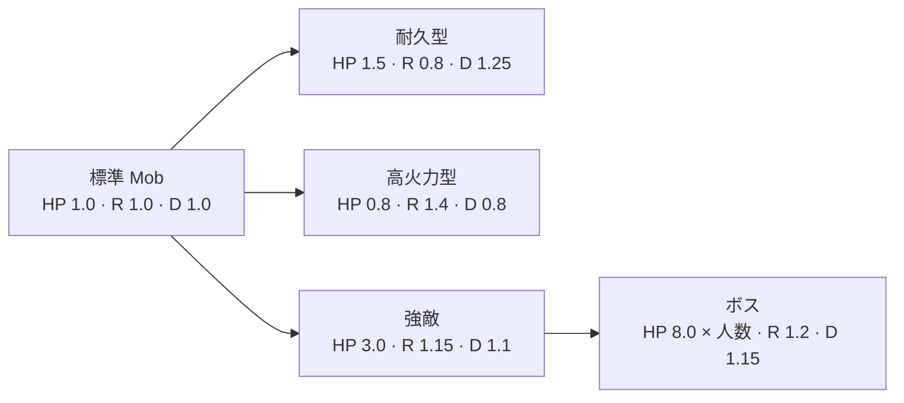
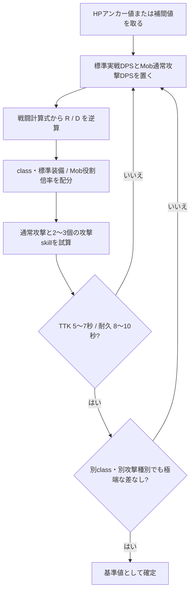

# 成長曲線

> [!abstract] この資料で確認すること
> Lv.1～30 のプレイヤーと同格 Mob の目標値、TTK、耐久時間を定める。ダメージの計算順序と式は [[01-戦闘計算]] を参照する。

> [!info] この資料の索引
> - [[#3. プレイヤーの基準|プレイヤーのアンカー値と配分]]
> - [[#4. Mob の基準|同格 Mob・役割別の倍率]]
> - [[#5. 値を決める手順|数値調整の反復手順]]

> [!summary] まず押さえる基準
> **対象:** Player Lv.1〜30 ／ **通常敵 TTK:** 5〜7秒 ／ **プレイヤー耐久時間:** 8〜10秒

## 1. 目的

本書は、Player Lv.1～30 のプレイヤーと同格 Mob に共通する戦闘ステータスの基準を定める。本書でいうレベルは、特記しない限り Player Level であり、class level ではない。

ここで示す値は、レベルから自動加算する実装式ではない。標準的な class、同レベル帯の equipment、恒常的な補正を合算した、戦闘開始時の最終目標値である。buff、一時効果、skill の威力倍率は含めない。

## 2. 基準値の読み方

| 項目 | 意味 |
|:--|:--|
| 最大 HP | 最終 `MAX_HEALTH` |
| 解決攻撃力 `R` | [[01-戦闘計算]] の式で求める、威力倍率適用前の攻撃力 |
| 有効防御 `D` | 貫通がない標準戦での `DEFENSE` と対応する種別防御の合計。攻撃種別ごとに確認する最終目標値 |
| MP / EN | そのリソースを使う class の最終最大値 |

`R` と `D` はマスタ項目ではなく、複数 status を合算した結果の基準である。`ATTACK`、主能力値、種別攻撃力は、組み合わせた結果が `R` に近づくように配分する。

> [!tip] 数値の使い分け
> 表の値は最終目標値であり、単一の YAML 項目へそのまま設定する値ではない。class・equipment・skill の役割ごとに配分し、[[01-戦闘計算#5. 計算例|戦闘計算の例]]で最終結果を確認する。

## 3. プレイヤーの基準

### 3.1 レベル別の最終目標値

> [!example] アンカー一覧
>
> | Player Lv. | 基準最大 HP | 対・標準 Mob `R` | 対・標準 Mob `D` | 装備更新帯 |
> |--:|--:|--:|--:|:--|
> | 1 | 50 | 17 | 18 | 初期装備 |
> | 5 | 250 | 87 | 91 | 第1更新 |
> | 10 | 1,000 | 348 | 362 | 第2更新 |
> | 15 | 2,200 | 767 | 797 | 第3更新 |
> | 20 | 4,000 | 1,394 | 1,449 | 第4更新 |
> | 25 | 6,500 | 2,264 | 2,355 | 第5更新 |
> | 30 | 9,500 | 3,318 | 3,442 | 第6更新 |

アンカー間は直線補間し、最終的なマスタ値は扱いやすい整数へ丸める。Lv.1～10 は基準 HP が20倍となる序盤の急成長帯とし、Lv.10 以降は伸びを緩める。HP、`R`、`D` を同じ成長係数で伸ばすことはしない。

`R` と `D` は、表の HP から直接倍率を決めない。[[#4.1 同格の標準 Mob|同格 Mob の実ダメージ・成功命中回数]]の実戦ローテーションを満たすように [[01-戦闘計算#4. 統合ダメージの計算式|戦闘計算式]]から逆算した値である。逆算後の値を `ATTACK`・基本能力値・種別攻撃力、および `DEFENSE`・種別防御へ配分する。

> [!tip] アンカーの読み方
> MP / EN は skill の使用回数とコストを決める別曲線であり、HP の成長率を適用しない。`R` と `D` は、同格戦の実ダメージを確認した後に定める。

`D` は、全攻撃種別で同じ実ダメージ目標を満たす規範目標とする。ただし、現行の補正なし Lv.1 では魔法 `D` が18となるため、負のマスタ補正では合わせず、status 基礎値・派生係数の将来調整対象とする。調整までは魔法のみ実測値で検証する。

### 3.2 割合系 status

割合系 status は数値の膨張を避けるため、レベルだけでは増やさない。

| status | 標準値 |
|:--|--:|
| `ACCURACY` | 95% |
| `EVASION` | 3.5% |
| `CRITICAL_RATE` | 5.5% |
| `CRITICAL_DAMAGE` | 150% |
| `ATTACK_SPEED` | 105 |
| `FINAL_DAMAGE_MULTIPLIER` | 130% |

これらを変える場合は class や equipment の特徴として扱い、同格相手への命中率、DPS、耐久時間を再確認する。Shield と属性耐性は標準値へ含めず、それを強みとする構成だけに配分する。

### 3.3 class と equipment への配分

> [!note]- 基準配分
> Lv.1 の共通基礎値は成長配分の外とする。Lv.1 から各アンカーまでの HP、`R`、`D` の増加分は、**class・レベル成長 25% / equipment 50% / skill tree 25%** を目安に配分する。基本能力値から生じる派生分は、その基本能力値を増加させた計上先へ含め、重ねて計上しない。

> [!note]- 職業差
> 攻撃型は `R`、防御型は HP と `D` を基準から最大20%程度ずらし、別の軸を下げて補う。

> [!note]- skill と装備更新
> 個別 skill の強さは `R` を増やして表現せず、威力倍率・範囲・コスト・クールダウンで調整する。Player Lv.5 ごとに少なくとも1～2部位の主力 equipment を更新可能にし、更新前後の最終 `R` と `D`、および実ダメージを比較する。1回の更新で同格基準を大きく超えないよう、更新による総合戦闘性能の差は15～25%程度を目安とする。

> [!note]- skill の発動経路
> 通常攻撃は左クリック、skill はアクションリングから選択して発動する前提で評価する。アクションリングの操作時間で通常攻撃を失うため、単体攻撃 skill は100～110%ではなく、**150～180%**を初期目安とする。左クリックへ割り当てる連打 skill は120～140%、長いクールダウンの大技は220～300%を目安とする。左クリックへ割り当てても、skill のコスト・クールダウンは短縮しない。

> [!tip]- 操作コストの計測
> skill 試験では、リングを開いてから発動するまでの時間、発動中に失った通常攻撃回数、skill の命中回数、resource 消費、cooldown を記録する。倍率だけでなく、操作時間を含む実戦DPSが通常攻撃の1.5～1.8倍になることを受入条件とする。

> [!warning]- 設計上限
> 最適構成や将来装備を含む上限は、HP・`R`・`D` の基礎実数系に限り、標準アンカーの130%程度を目安とする。割合系 status と MP / EN はこの上限の対象外とする。

### 3.4 Player Level・Tier 1 class・equipment の進行

Player Level と class level は、獲得 EXP でそれぞれ独立に上昇する。Player Level 到達時に class level を設定する、または class level 到達時に Player Level を設定する強制同期は行わない。

class 別の戦闘バランス資料では、職業レベルを主軸にして `baseStats` と `growthPerLevel` の寄与を記載する。Player Level は、同じ進行上での装備更新・skilltree 解放・最終アンカーを照合するための補助情報として併記する。

`adventurer` の職業レベル上限は **Lv.30** とする。ほかの class の上限は、各 class のマスタデータで個別に定める。

Tier 1 の下位 class（`adventurer` を含む）は、Player Level よりレベル数が先行しやすくする。現在選択中の Tier 1 class は、Player EXP と class EXP の累積値を同じ割合で受け取るが、必要EXP曲線は別に持つ。現行 Player EXP 曲線では、Player Lv.10 の累積必要 EXP は hash 加算を除き **40,535 EXP** である。`expRate: 100` の class 曲線では class Lv.30 の累積必要 EXP は **70,405 EXP** となるため、同量EXPなら Player Lv.10 時点は class Lv.24、class Lv.30 は Player Lv.12 相当になる。

職業の上がりやすさは、固定の％や直線倍率で表さず、同じ累積EXPに対する Player Level と class level の対応表で管理する。Player EXP は `level²`、class EXP も `level²` を基礎にし、Player 側には波形・節目加算、class 側には10レベルごとの節目加算がある。`expRate` は class の必要EXP倍率であり、進行速度の％そのものではない。Player Lv.10 で class Lv.30 を目標にする場合は、現行曲線と報酬量のままなら `expRate` 約58%が初期試算となる。

class EXP は現在選択中の class にだけ加算する。転職後の class はそれぞれ独立した class EXP 曲線を使用し、未選択の Tier 1 class を同時に進行させない。`expRate: 100` の現行曲線では、Player Lv.10 到達時に選択中 Tier 1 class は class Lv.24 相当となり、class Lv.30 は Player Lv.12 相当である。Player Lv.10 で class Lv.30 を受入目標にする場合は、`expRate` 約58%を初期案として実測する。これはEXP曲線と付与比率を検証する条件であり、レベルを相互に設定する強制同期ではない。class level の早い上昇は、skill 解放・選択肢・小さな固有補正を主な報酬とする。基礎実数 status の大部分を class level の直線加算へ集中させず、Player Level と equipment の更新帯に残す。

Player Lv.30 は、1日8時間を7日間遊ぶ **56時間** を受入目標とする。現行 Player EXP 曲線で hash 加算を除く累積必要 EXP **1,078,430 EXP** を56時間で得るため、戦闘・quest・探索などを合算した平均獲得量を **約19,300 EXP/h** とする。実測では合計EXPとプレイ時間を記録し、56時間時点でLv.30へ到達できることを確認する。

Player Lv.5 ごとの更新帯では、少なくとも1～2部位の主力 equipment を、同レベル帯で入手できるようにする。Player Level は戦闘バランスのアンカーであり、equipment の `progression` 値そのものではない。各更新帯は quest初回報酬・Mob drop・shop・探索報酬のいずれか1つ以上の入手導線を持ち、更新前後の総合戦闘性能差が15～25%程度となることを受入条件とする。

## 4. Mob の基準

### 4.1 同格の標準 Mob

| Player / Mob Lv. | 最大 HP | 対・Player `R` | 対・Player `D` | `ACCURACY` | `EVASION` |
|--:|--:|--:|--:|--:|--:|
| 1 | 100 | 18 | 17 | 95% | 3% |
| 5 | 500 | 91 | 87 | 95% | 3% |
| 10 | 2,000 | 362 | 348 | 95% | 3% |
| 15 | 4,400 | 797 | 767 | 95% | 3% |
| 20 | 8,000 | 1,449 | 1,394 | 95% | 3% |
| 25 | 13,000 | 2,355 | 2,264 | 95% | 3% |
| 30 | 19,000 | 3,442 | 3,318 | 95% | 3% |

> [!success] 同格戦の目標
> | 指標 | 基準 |
> |:--|:--|
> | プレイヤー通常攻撃間隔 | 1.0秒 |
> | 標準 Mob 攻撃間隔 | 1.5秒 |
> | 通常敵 TTK | 5〜7秒 |
> | プレイヤー耐久時間 | 8〜10秒 |
> | Player の主基準 | 通常攻撃を継続しつつ、2〜3個の攻撃skillを自然に交える標準実戦DPS |
> | skill込みDPS | 同条件の通常攻撃期待DPSの約1.5〜1.8倍（アンカー基準は1.6倍） |
> | DPS構成比 | 通常攻撃55〜65% / 2〜3個の攻撃skill合計35〜45% |
> | skill 発動経路 | アクションリングを標準とし、操作時間と失った通常攻撃を計測 |
> | 除外対象 | utility・移動・防御skill、AoE追加対象、長CD burst、完全な最適化 |
> | 標準 Mob の攻撃 | 通常攻撃のみを基準とし、遭遇固有skillは別途定義 |
>
> Player は `FINAL_DAMAGE_MULTIPLIER` 130%、Mob は100%とする。Mob の会心率は0%を標準とし、急な大ダメージは高火力型など役割が明確な Mob だけに持たせる。

> [!example] アンカーの再現式
> 表の `R` / `D` は、無属性（属性倍率100%）、貫通・耐性・Shield・固定HPダメージ・一時補正なし、会心なしの値である。Player / Mob は `ACCURACY 95%`、相手の `EVASION` はそれぞれ3.5% / 3%であり、期待命中率はPlayer→Mob 92%、Mob→Player 91.5%となる。双方の攻防比を `D / R = 1.0`（防御後50%）としている。
>
> | 向き | 1 hit実ダメージ | 攻撃間隔 | 期待DPS | 主指標 |
> |:--|--:|--:|--:|:--|
> | Player 通常攻撃 → Mob | `Player R × 0.50 × 1.30` | 1.0秒 | `Player R × 0.50 × 1.30 × 0.92` | DPS構成の55〜65% |
> | Player 標準実戦 → Mob | 通常攻撃と2〜3個の攻撃skillの合計 | 同格単体戦 | 通常攻撃期待DPSの約1.5〜1.8倍（基準1.6倍） | TTK 5〜7秒 |
> | Mob 通常攻撃 → Player | `Mob R × 0.50` | 1.5秒 | `Mob R × 0.50 × 0.915 / 1.5` | 耐久8〜10秒 |
>
> 標準実戦DPSは、同格・単体・一時補正なしで、通常攻撃を継続しながら2〜3個の攻撃skillを自然に使う場合の平均DPSとする。6種類すべてのskillの使用、厳密なskill順、理論上の最適化は要求しない。攻撃skillのdamage・cooldown・resource・cast timeに加え、アクションリングの選択時間と、その間に失う通常攻撃を含めて調整する。Lv.10では Player `R=348` / Mob `D=348` により、通常攻撃期待DPSは約208、標準実戦DPS基準は約333、Mob HP 2,000に対するTTKは約6秒となる。Mob `R=362` / Player `D=362` により、Mobの期待DPSは約110、Player HP 1,000に対する耐久時間は約9秒となる。

> [!note] 検証条件
> 標準実戦試験では、同格アンカーの Player / Mob `R` / `D` と表の `FINAL_DAMAGE_MULTIPLIER` を使い、使用した2〜3個の攻撃skillについて属性・威力倍率・命中回数・cooldown・resource消費・cast time・アクションリング操作時間・失った通常攻撃回数を記録する。通常攻撃と攻撃skillのDPS構成比が55〜65% / 35〜45%に収まり、操作コスト込みのskill込みDPSが通常攻撃期待DPSの約1.5〜1.8倍となることを確認する。TTKは初回操作開始からMob HPが0になるまで、耐久時間はMobの初回攻撃開始からPlayer HPが0になるまでを測る。命中・会心の乱数は各100戦の平均値で確認し、アンカー再現式は会心なしの期待命中率で事前検算する。

### 4.2 役割ごとの倍率

同格の標準 Mob を `1.0` とし、役割に応じて次の倍率を掛ける。

| 役割 | 最大 HP | `R` | `D` |
|:--|--:|--:|--:|
| 通常敵 | 1.0 | 1.0 | 1.0 |
| 耐久型 | 1.5 | 0.8 | 1.25 |
| 高火力型 | 0.8 | 1.4 | 0.8 |
| 強敵 | 3.0 | 1.15 | 1.1 |
| ボス | 8.0 × 想定参加人数 | 1.2 | 1.15 |

ボスの HP は想定参加人数に合わせるが、攻撃力と防御力は人数だけでは増やさない。複数対象攻撃、行動間隔、フェーズなどは個別の遭遇設計で調整する。

## 5. 値を決める手順

> [!todo] 反映前チェック
> - [ ] 対象レベルのアンカー値、または補間値を使った。
> - [ ] 標準実戦DPSとMob通常攻撃DPSを先に定め、計算式から `R` と `D` を逆算した。
> - [ ] class・標準 equipment、または Mob の役割倍率を反映した。
> - [ ] 通常攻撃と2〜3個の攻撃skillによる標準実戦を試算した。
> - [ ] TTK・耐久時間を主指標、標準実戦DPSを補助指標として確認した。
> - [ ] 同じレベル帯の別 class・別攻撃種別でも確認した。

本書は基準値だけを定める。個別 class、equipment、skill、Mob のマスタ値は、それぞれの役割と入手段階に合わせて別途配分する。
