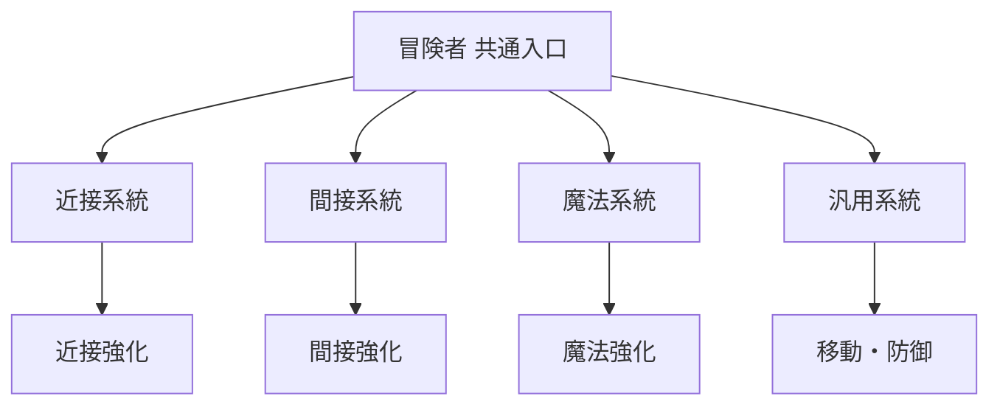

# 冒険者のクラス別戦闘バランス

> [!abstract] この資料で確認すること
> 冒険者を、近接・間接・魔法の各戦闘方法を試せる初期クラスとして設計する。成長曲線上の基準値を、class・標準 equipment・skill・skilltree へどのように配分するかを定め、確定した内容を各 filebase マスタへ反映するための作業基準とする。

> [!info] 参照する資料
> - [[../01-戦闘計算|戦闘計算]]
> - [[../02-成長曲線|成長曲線]]
> - [[../../../50_Filebase設計書/feature/20-class|Class 設計]]
> - [[../../../50_Filebase設計書/feature/30-skill|Skill 設計]]
> - [[../../../50_Filebase設計書/feature/35-skilltree|Skilltree 設計]]

## 1. 位置づけ

冒険者は、Player Lv.1 から選択できる初期クラスである。近接・間接・魔法の三系統を同時に試せる代わりに、各系統に特化した一次職よりも、単一系統の最大性能と役割の明確さで劣る。

冒険者の価値は、最終的な性能上限ではなく、次の進路を決めるまでの試行と適応にある。

| 項目 | 冒険者の方針 |
|:--|:--|
| 主な距離 | 近距離・中距離・遠距離を切り替え可能 |
| 攻撃方法 | 近接攻撃・飛翔体や設置物・魔法攻撃 |
| 攻撃軸 | 特定の `MELEE_ATTACK` / `RANGED_ATTACK` / `MAGIC_ATTACK` に依存せず、共通 `ATTACK` を基礎とする |
| 生存方法 | 平均的な HP・防御・回避。明確な防御特化は持たない |
| リソース | `ENERGY` と `MANA` の両方を扱える |
| 適性 | 装備と skill の組み合わせを変えて複数の構成を試せる |
| 弱点 | 特定分野の継続火力、瞬間火力、生存力、射程のいずれも専門職に及ばない |

> [!warning] 下位互換の意味
> 冒険者は、ハンター・メイジ・ソードマンの各専門分野において、最終的な単一目的の性能では下位となる。ただし、三系統を同時に利用できること、装備変更による対応力、skill の選択幅は冒険者固有の価値として残す。単一の専門職をすべて弱くしただけのクラスにはしない。

## 2. 成長曲線との接続

冒険者の強さは、[[../02-成長曲線|成長曲線]] の Player Lv.1～30 の最終目標値から逆算する。ここで扱う `HP`、`R`、`D` はマスタ項目そのものではなく、class・標準 equipment・skilltree を合算した最終値である。

| 目標 | 冒険者での扱い |
|:--|:--|
| `MAX_HEALTH` | 標準値。専門職の防御型より低く、攻撃特化職との差は小さくする |
| 解決攻撃力 `R` | 近接・間接・魔法で共通に参照できる基礎値を目標にする |
| 有効防御 `D` | 標準値。防御型専門職より低く、攻撃特化職より高い中間値を目標にする |
| `MAX_MANA` / `MAX_ENERGY` | 両方を確保する。ただし両リソースを同時に大量消費する構成にはしない |
| 割合系 status | 成長で過度に増やさず、装備・skill の個性として扱う |

### 2.1 暫定的な職業差

専門職との比較は、同じ Player Level、同じ更新帯、同程度の標準装備で行う。以下は最終値を決める前の設計目安である。

| 比較対象 | 冒険者の目標 |
|:--|:--|
| 専門職の主力分野 | 専門職の標準実戦 DPS の 80～90% 程度 |
| 専門職の非主力分野 | 冒険者が装備・skill を寄せた場合に限り、専門職の 70～85% 程度 |
| 三系統を混ぜた場合 | 各系統の skill を使い分けられるが、単一系統の最適構成より低い |
| 標準敵への TTK | [[../02-成長曲線#4.1 同格の標準 Mob|同格戦]]の目標範囲 5～7 秒から大きく外れない |
| プレイヤー耐久時間 | 標準 Mob に対して 8～10 秒を基準とする |

この表は、三系統を組み合わせることで専門職を上回ることを禁止するものではない。複数系統への対応力と引き換えに、単一系統へ最適化した専門職より、操作・装備・skill 選択の難しさを残す。

## 3. ステータス配分方針

### 3.1 共通攻撃力を中心にする

冒険者は、特定攻撃種別の status をクラス成長の中心にしない。基本となる `ATTACK` と、各基本能力値から派生する生存・リソース系 status を均等に配分し、近接・間接・魔法のすべてで最低限の攻撃性能を確保する。

| 分類 | 冒険者の配分方針 | 理由 |
|:--|:--|:--|
| `ATTACK` | 三系統に共通する主軸 | 武器や skill の交換で戦闘方法を変えられるようにする |
| `STRENGTH` | 中程度 | 近接への適性を持たせるが、ソードマンより低くする |
| `DEXTERITY` | 中程度 | 間接攻撃への適性を持たせるが、ハンターより低くする |
| `INTELLIGENCE` | 中程度 | 魔法への適性を持たせるが、メイジより低くする |
| `VITALITY` | 中程度 | 極端に脆くならないための共通防御基盤 |
| `AGILITY` | 中程度 | 攻撃間隔・移動・回避を確保する |
| `LUCK` | 低～中程度 | 汎用性は持たせるが、会心特化にはしない |
| `MAX_MANA` | 中程度 | 魔法 skill を試せる最低限の継続力 |
| `MAX_ENERGY` | 中程度 | 近接・間接 skill を試せる最低限の継続力 |
| `MELEE_ATTACK` / `RANGED_ATTACK` / `MAGIC_ATTACK` | class では原則として特化させない | 武器・skill・専門職との差別化を残す |

基本能力値からの派生値は、[[../01-戦闘計算#10. 基本能力値からの派生|基本能力値からの派生]]に従って一度だけ計上する。最終目標値を class と skilltree の両方へ重複配分しない。

### 3.2 レベル帯別の配分目安

以下は、`02-成長曲線.md` の Lv.1、5、10、15、20、25、30 アンカーへ適用するための初期案である。数値は class YAML の確定値ではなく、最終値の内訳を決めるための割合である。

| Player Lv. | class / class 成長 | 標準 equipment | skilltree | 設計意図 |
|--:|--:|--:|--:|:--|
| 1 | 25% | 50% | 25% | 初期装備で三系統を試せる状態を作る |
| 5 | 25% | 50% | 25% | 装備更新で戦闘方法を選び始める |
| 10 | 25% | 50% | 25% | 一次転職を選ぶ比較材料を揃える |
| 15 以降 | 20～25% | 50～55% | 20～25% | 上位職の専門性と装備差を明確にする |

class の基礎値と `growthPerLevel` は、class level の上昇に伴う共通基盤を定義する。特定 Player Lv. の戦闘力を class level だけで作らず、Player Level、equipment 更新、skilltree の選択に分散させる。

## 4. 標準 equipment の考え方

冒険者の標準 equipment は、特定攻撃種別を大きく増やさず、共通 `ATTACK`、HP、防御、両リソースを中心に配分する。

| 装備枠の役割 | 標準方針 |
|:--|:--|
| 武器 | 近接・間接・魔法のいずれかを選べる。更新前後の共通 `ATTACK` を比較する |
| 防具 | HP・`DEFENSE`・`MAGIC_DEFENSE` を平均的に持たせる |
| 補助装備 | `MAX_MANA` / `MAX_ENERGY`、攻撃速度、移動などから選択する |
| 特化装備 | 各専門職へ進む前の試行用。単一攻撃種別を伸ばす場合は総合性能を抑える |

冒険者向けの標準装備を評価するときは、[[../02-成長曲線#3.3 class と equipment への配分|成長曲線の配分基準]]に従い、更新一回あたりの総合戦闘性能が 15～25% 程度を超えないことを確認する。

## 5. skill 構成

冒険者は、近接・間接・魔法の各系統を最低限ひとつずつ持つ。加えて、移動または防御の汎用 skill を持たせ、三系統を試すための安全性を確保する。

### 5.1 初期 skill パッケージ案

| 系統 | skill の役割 | 主な用途 | 専門職との差 |
|:--|:--|:--|:--|
| 近接 | 単体攻撃または小範囲攻撃 | 接近時の安定した攻撃 | ソードマンより威力・防御連携が低い |
| 間接 | 飛翔体または設置攻撃 | 距離を取った攻撃 | ハンターより射程・連射・追撃性能が低い |
| 魔法 | 単体または小範囲魔法 | 属性や距離を利用した攻撃 | メイジより倍率・範囲・リソース効率が低い |
| 汎用 | 移動、回避、短時間防御など | 系統変更や危険回避 | 専門職の固有防御・移動 skill ほど強くしない |

初期の具体的な skill 数、ID、係数、cooldown、コストは、この資料で直接確定しない。各 skill の主目的と実戦寄与を決めた後、`30.features.skill` の YAML として定義する。

### 5.2 スキル強度の目安

冒険者の攻撃 skill は、単発の倍率だけで専門職との差を表現しない。次の要素を組み合わせて調整する。

- 威力倍率
- 命中回数と発生速度
- cooldown
- `MANA` / `ENERGY` のコスト
- 射程、範囲、追尾性
- 発動中の安全性
- 状態異常、移動、設置などの付加効果

標準実戦では、通常攻撃を継続しながら 2～3 個の攻撃 skill を使う。[[../02-成長曲線#4.1 同格の標準 Mob|同格戦の基準]]に従い、通常攻撃 55～65%、攻撃 skill 35～45% 程度の DPS 構成を初期検証値とする。

## 6. skilltree のポイント配分

skilltree は、冒険者が三系統を試すための共通入口と、各系統へ寄せる分岐を持つ。ポイントをすべて一系統へ投入した場合でも専門職の完全な代替にはならず、複数系統へ分散した場合は対応力を得る代わりに単一分野の伸びが小さくなる構造を目標とする。

### 6.1 ツリー構造の初期案

| 分岐 | 効果の方向 | 配分上限の考え方 |
|:--|:--|:--|
| 共通入口 | `ATTACK`、HP、リソース、基本操作 | 最初に取得できる共通基盤 |
| 近接 | 近接 skill と接近時の安定性 | ソードマンの専門強化より低い |
| 間接 | 射程、飛翔体、位置取り | ハンターの専門強化より低い |
| 魔法 | 魔法 skill、属性、MANA運用 | メイジの専門強化より低い |
| 汎用 | 移動、回避、短時間防御 | 専門職の固有 utility と競合させない |

### 6.2 ポイント設計の保留事項

skilltree の解放条件は現在、職業条件と Player Level を使用し、職業レベル条件は持たない。したがって、次の項目を確定してから JSON マスタへ反映する。

- Player Level ごとの累積 skill point
- 共通入口から各分岐へ進むための必要 point
- 各ノードの `status` 効果と上限
- skill ノードの取得順と排他関係
- 三系統を均等取得した場合の標準性能
- 一系統へ集中取得した場合の専門職との差
- 転職後に冒険者のノードを維持するかどうか

## 7. 標準構成と試験構成

最初のバランス検証では、理論上の全ノード取得や全 skill の最適順を評価対象にしない。次の三構成を用意する。

| 構成 | 装備・skill の方向 | 確認すること |
|:--|:--|:--|
| 均等型 | 近接・間接・魔法を均等に取得 | 冒険者らしい対応力と総合性能 |
| 近接寄せ | 近接武器と近接 skill を優先 | ソードマンへの移行動機と下位互換性 |
| 遠隔・魔法寄せ | 間接または魔法の一方を優先 | ハンター・メイジとの差と装備依存度 |

各構成について、同格の標準 Mob を対象に次を記録する。

- 通常攻撃と攻撃 skill の DPS 構成比
- TTK 5～7 秒への適合
- プレイヤー耐久時間 8～10 秒への適合
- MANA / ENERGY が枯渇するまでの時間
- 攻撃距離を変更したときの性能差
- 同じ装備で攻撃系統だけを変えたときの性能差

## 8. 専門職への接続

冒険者から一次職へ進む判断材料は、冒険者の性能不足だけにしない。各専門職は、冒険者で試した系統を、より明確な役割と高い上限へ伸ばす。

| クラス | 冒険者からの発展 |
|:--|:--|
| `swordsman` | 近接の威力、防御、接近・前線維持を強化 |
| `hunter` | 間接の射程、位置取り、連射、設置を強化 |
| `mage` | 魔法の倍率、属性、範囲、MANA運用を強化 |

冒険者が三系統を組み合わせて専門職を上回る場合は、skill の utility や対応力による一時的な優位なのか、恒常的な DPS 優位なのかを分けて確認する。恒常的な単一系統 DPS が専門職を上回る場合は、冒険者の `ATTACK`、skill 倍率、装備補正、skilltree 効果のいずれかを再調整する。

## 9. マスターデータへの反映順

この資料を基準に、次の順で filebase へ反映する。

1. `adventurer` class の基礎値と成長値を決める。
2. 冒険者用の標準 equipment を Player Lv.1～30 の更新帯へ配置する。
3. 近接・間接・魔法・汎用 skill の役割と実装可能な効果を確定する。
4. skilltree の共通入口、三系統分岐、汎用分岐を作成する。
5. 均等型・特化寄せの三構成を試算する。
6. TTK、耐久時間、DPS 構成比、リソース持続を確認する。
7. 確認済みの値だけを各マスタへ反映する。

class・skill・skilltree の具体的な ID、YAML / JSON の項目、実装に依存する action は、それぞれのスキーマと Plugin 設計を正本とする。この資料へマスタの全項目を複製しない。

## 10. 未決事項

- [ ] 冒険者の class level ごとの `ATTACK`、HP、防御、MANA、ENERGY の確定値
- [ ] 三系統の初期 skill 名、skill 数、取得順
- [ ] 冒険者が保持できる skill の最大数と bind 方法
- [ ] 各 skill の実戦 DPS 寄与率と utility の評価方法
- [ ] Player Level ごとの skill point 累積値
- [ ] skilltree の三系統分岐における排他・前提条件
- [ ] 転職後に冒険者の skilltree 効果を維持するかどうか
- [ ] 冒険者向け標準 equipment の具体的な更新帯と入手経路
- [ ] `ATTACK` と各攻撃種別 status の最終的な併用ルール

> [!todo] 次の作業
> まず Player Lv.1、10、20、30 の四点について、均等型・近接寄せ・間接または魔法寄せの三構成を作り、[[../02-成長曲線|成長曲線]]のアンカーと [[../01-戦闘計算|戦闘計算]]の実測結果を比較する。
