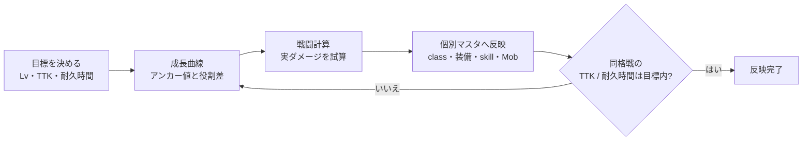
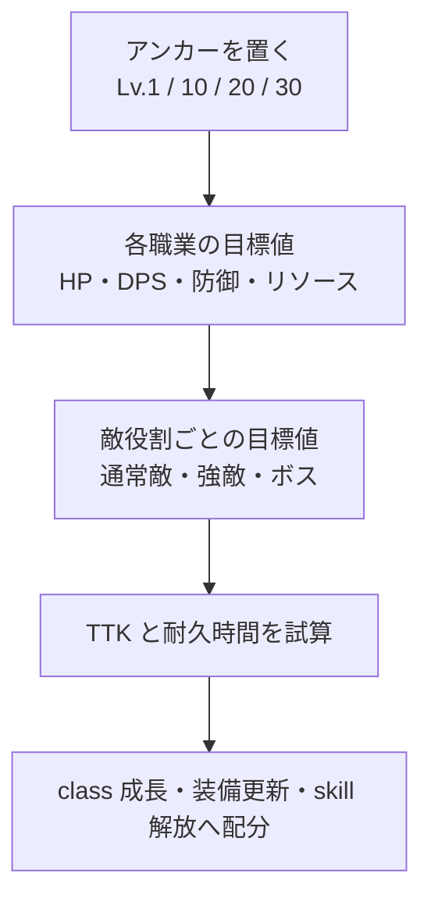

# 戦闘バランス設計書

> [!abstract] この設計書の使い方
> 数値を調整するときは、まず [[02-成長曲線]] で目標値を確認し、次に [[01-戦闘計算#4. 統合ダメージの計算式|戦闘計算式]]で実際のダメージを試算する。個別マスタの形式や ID は、この設計書ではなく各カテゴリの正本に従う。

> [!info] すぐに開く
> - [[01-戦闘計算#2. 先に押さえる要点|計算の前提と例外]]
> - [[01-戦闘計算#5. 計算例|具体的なダメージ試算]]
> - [[02-成長曲線#3. プレイヤーの基準|プレイヤーのアンカー値]]
> - [[02-成長曲線#4. Mob の基準|Mob・ボスの基準]]
> - [[04-レベル帯コンテンツ設計|レベル帯ごとの敵・ダンジョン・更新]]

## 目的

本設計書は、RPG 戦闘における数値目標、成長曲線、職業・敵・装備・skill の相対的な強さを定める。
個別の YAML 構造や ID、マスタの記述形式は定めない。ここで決めた基準値を、各 feature の filebase マスタへ一貫して反映するためのゲームデザイン上の正本とする。

## 読む順番

> [!abstract]- 資料の役割
> - [[01-戦闘計算]]: 現在実装されている戦闘・経験値計算式、処理フロー、参照元
> - [[02-成長曲線]]: Lv.1～30 のプレイヤーと同格 Mob の基準値、TTK・耐久時間の目標
> - [[04-レベル帯コンテンツ設計]]: Lv.1～30 で戦う敵、攻略するコンテンツ、次の更新先

## 正本の境界

> [!success] この設計書で決めること
> 戦闘の目標時間、成長曲線、数値配分。つまり「どの強さを目標にするか」を決める。

> [!warning] ここでは決めないこと
> - ダメージ計算の実装仕様・補正順序: [[00_docs/10_Plugin設計書/feature/14-combat/14_0-概要|戦闘実装設計]]
> - マスタカテゴリの役割・進行度の接続方針: [[00_docs/50_Filebase設計書/README|Filebase 設計書]]
> - YAML の項目・型・参照形式: `40_filebase` 配下の YAML スキーマ定義
> - status ID・表示メタデータ: `40_filebase/75.shared.status/v1.status_types.yml`

本設計書で `progression` をプレイヤーレベルとして扱わない。`progression` は、既存の Filebase 設計に従い、標準的な遭遇・入手・更新の順序を表す。

## 設計の基本単位

戦闘バランスは、個々のステータス値ではなく、次の結果で評価する。

> [!example] 撃破・生存
> - **TTK**: プレイヤーが敵を倒すまでの時間
> - **耐久時間**: 敵から継続的に攻撃された場合にプレイヤーが倒れるまでの時間

> [!example] 継続性能・成長実感
> - **DPS**: 実戦で継続して与えられるダメージ量
> - **リソース持続**: mana / energy 等を枯渇させずに戦える時間と回復余地
> - **更新幅**: 装備・skill・レベル上昇によって得る戦闘性能の差

数値を変更するときは、少なくとも同格の通常敵に対する TTK と耐久時間への影響を確認する。

> [!tip] 調整の順序
> まず [[02-成長曲線#5. 値を決める手順|成長曲線の手順]]で目標を置き、[[01-戦闘計算#5. 計算例|計算例]]で確認する。個別マスタへ反映する前に、対象の `progression`・入手元・攻略対象・更新先を確認する。

## 成長曲線の決め方

現在の class YAML の `baseStats` と `growthPerLevel` は基礎成長を表す。大きな戦闘力の節目は、class の成長値だけへ集中させず、装備更新と skill の選択によって作る。

## マスタへの反映

> [!note]- class / equipment / skill
> - **class**: 初期性能、レベル成長、職業ごとの強みと弱み。カテゴリ方針は `50_Filebase設計書/feature/20-class.md`。
> - **equipment / item**: `progression` ごとの更新幅、職業別の性能配分。各 item 関連 feature と YAML スキーマに従う。
> - **skill**: 主目的、実質 DPS、範囲・拘束・安全性とコストの交換条件。カテゴリ方針は `50_Filebase設計書/feature/30-skill.md`。

> [!note]- Mob / economy
> - **mob / enemy / boss**: 敵の役割、同格プレイヤーに対する HP・攻撃・耐久の目標。各 mob 関連 feature と YAML スキーマに従う。
> - **loot / recipe / shop**: 更新品を得る時期と、攻略順を飛ばさない供給量。各 economy 関連 feature と YAML スキーマに従う。

個別マスタへ値を記載する前に、対象の `progression`、入手元、攻略対象、更新先を確認する。YAML へスキーマ未定義の戦闘バランス用プロパティは追加しない。

## 最初の検証範囲

> [!todo] Lv.1〜30 の確認チェックリスト
> - [ ] `adventurer`、`swordsman`、`hunter`、`mage` を比較する。
> - [ ] 通常敵、耐久型、高火力型を各 1 種類以上用意する。
> - [ ] 通常攻撃・主力 skill・回復または防御手段を含む代表戦闘を確認する。
> - [ ] 装備・skill・loot が想定した `progression` 順に更新されることを確認する。

## 分割方針

README が運用しづらくなった時点で、必要な章だけを追加する。

- `02-成長曲線.md`: レベル帯ごとの基準表
- `03-職業・敵の基準.md`: アーキタイプ別の性能配分
- `04-レベル帯コンテンツ設計.md`: レベル帯ごとの敵・ダンジョン・更新

分割後も、本 README は設計書の目的、正本の境界、参照先の索引として維持する。

## Obsidian 編集ルール

> [!important] 必須
> 今後、この `60_戦闘バランス設計書` 配下の文章を修正・追加するときは、[kepano/obsidian-skills](https://github.com/kepano/obsidian-skills) の `obsidian-markdown` skill を使用し、Obsidian で読みやすい Markdown として出力する。

- 資料の先頭には、内容に合う `title`・`aliases`・`tags` のプロパティを付ける。
- 同じ Vault 内の Markdown 資料・見出しへの参照には、通常のパス文字列ではなく `[[Wiki リンク]]` を使う。
- ディレクトリ、YAML、ソースコードなど Markdown 資料ではない参照先は、正確な場所を示すインラインコードのパス表記を使う。
- 判断基準、注意点、作業手順など、本文から目立たせる情報には Obsidian callout を使う。
